# Sketch-to-Image: полный отчёт по экспериментам

*2026-04-01*

Тестовый набор: 16 фиксированных QuickDraw скетчей, 5 классов разной сложности:
- **apple** (4 шт) — простая геометрия, один объект
- **cat** (3 шт) — органика, средняя сложность
- **house** (3 шт) — геометрия + детали
- **bird** (3 шт) — органика посложнее
- **bicycle** (3 шт) — сложная структура, много тонких частей

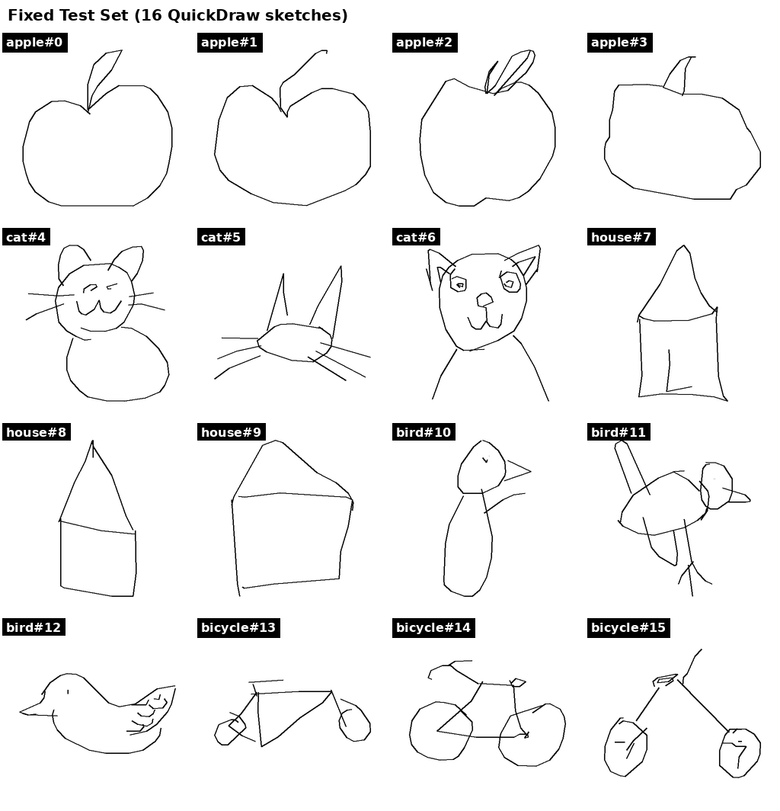

Метрика: **SigLIP2** — косинусная близость к промпту `a high quality illustration of a {label}`. Выше = лучше, 0 = граница "50% вероятности соответствия".

---

# Часть 1: Эволюция пайплайна (run_experiments)

Пошаговое усложнение пайплайна, от сырого скетча до полной обработки. Каждый этап добавляет один компонент.

## Stage 1: Baseline — сырой скетч

Скетч из QuickDraw → lineart → ControlNet + Diffusion + Refiner. Одна генерация, никакого отбора.

### SD1.5 (Dreamshaper) — avg = -0.52
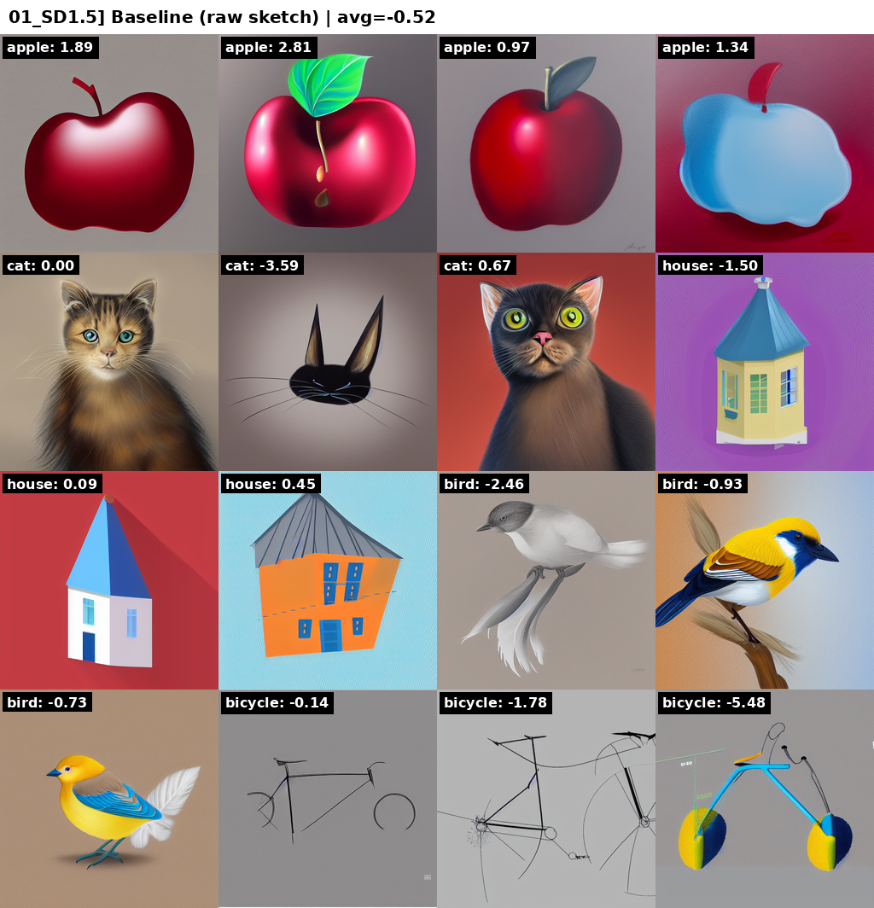

### SDXL — avg = -0.37
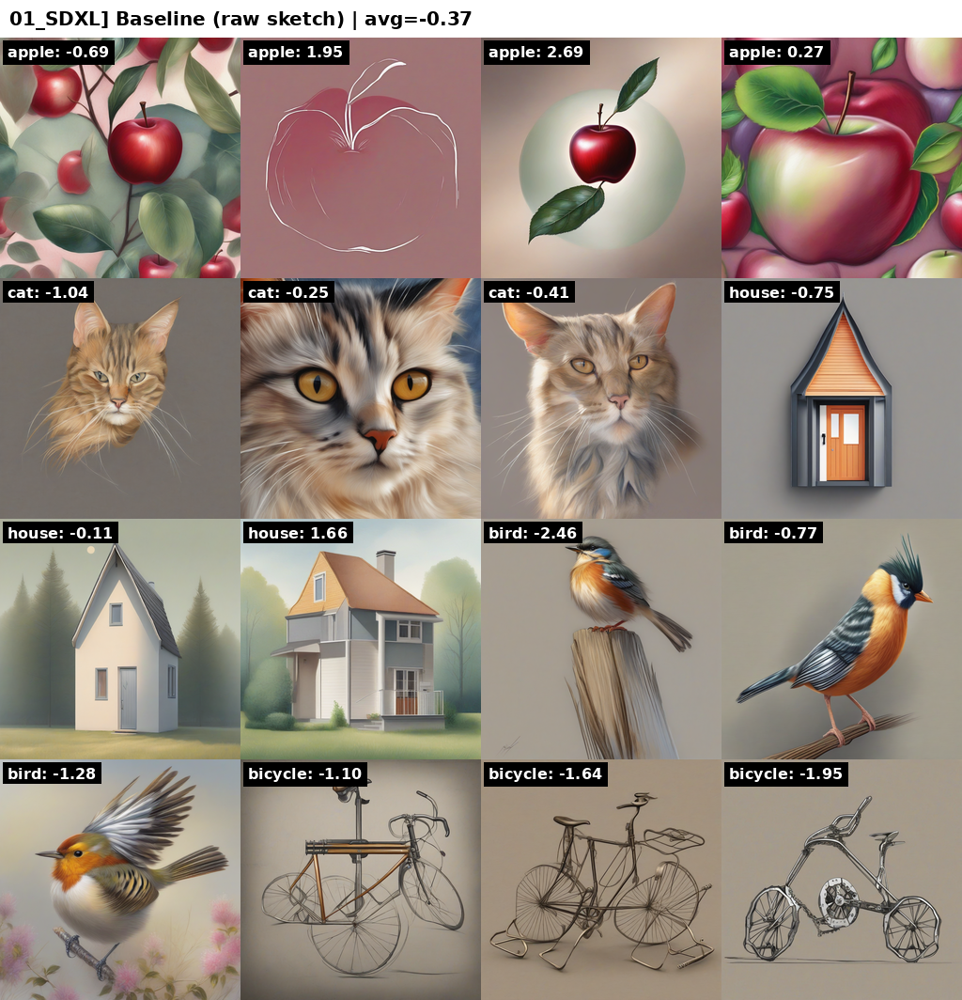

**Что видим:**
- Apple: SD15 справляется хорошо (1.9, 2.8), но apple#3 (-0.88) выдал кашу из яблок на листьях. SDXL apple#0 (-0.69) — яблоки на ветках, apple#1 (1.95) — едва заметный контур вместо картинки.
- Cat: SD15 cat#5 (-3.59) — чёрный силуэт с торчащими ушами, жуть. SDXL коты приличнее, но painterly стиль размывает детали.
- House: разброс огромный. SD15 house#7 (-1.50) — домик-фонарик на фиолетовом фоне. SDXL house#7 (-0.75) — тоже фонарик.
- Bird: пластиковые 3D-рендеры. SD15 bird#10 (-2.46) — птица с размытыми крыльями в полёте. SDXL bird#10 (-2.46) — та же история.
- Bicycle: катастрофа. SD15 bicycle#15 (-5.48) — абстрактная скульптура из труб. SDXL чуть лучше но всё равно страшно.

**Вывод:** без фильтрации качество нестабильное, сильно зависит от удачи сида. Велосипеды и птицы — слабое место обеих моделей.

---

## Stage 2: DomainNet sketch refinement

Вместо грубого QuickDraw скетча (3-10 штрихов) ищем ближайший скетч из DomainNet через SigLIP2 эмбеддинги. DomainNet скетчи показывают анатомию и структуру значительно лучше.

### SD1.5 — avg = -0.36 (было -0.52, delta +0.16)
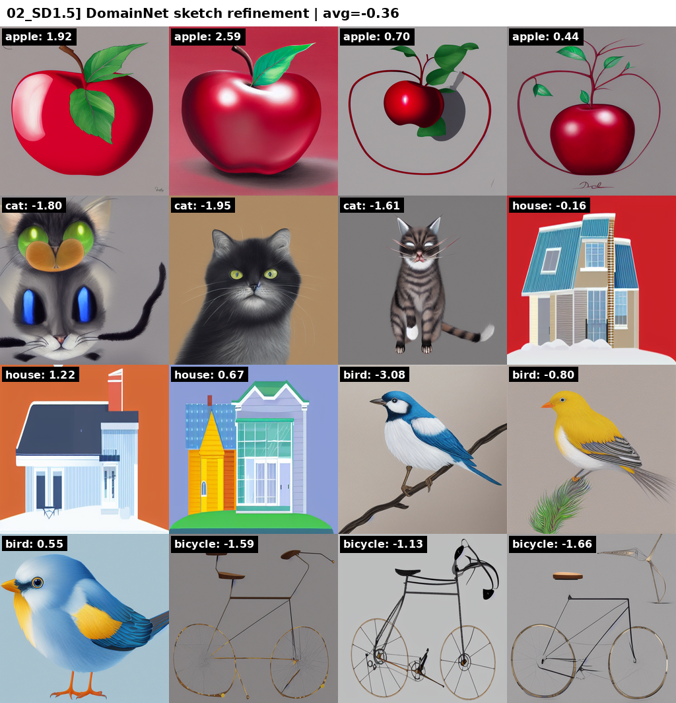

### SDXL — avg = 0.20 (было -0.37, delta +0.57)
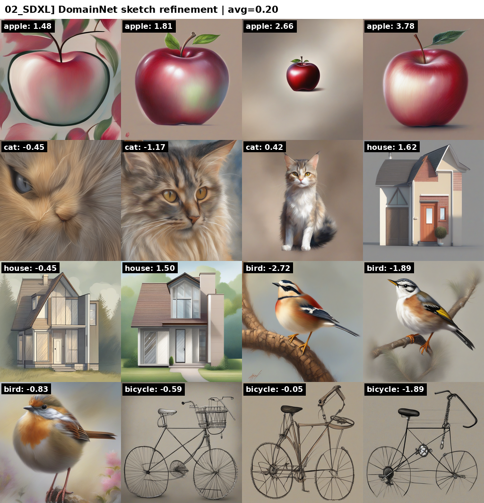

**Что видим:**
- Apple: без изменений — яблоко и так простое, DomainNet не даёт преимущества. SDXL apple#3 аж 3.78 — чистейший рендер.
- Cat: **стало хуже на SD15!** Все три кота получили -1.6...-1.95. DomainNet подобрал мультяшные скетчи котов с гипертрофированными чертами — ControlNet это усилил. Огромные глаза, кривые пропорции. SDXL справился лучше, cat#6 (0.42) — нормальный кот.
- House: заметный рост. SD15 house#8 с 0.09 подскочил до 1.22. SDXL house#7 с -0.75 до 1.62. DomainNet дал более структурированные скетчи зданий.
- Bird: SD15 bird#10 с -2.46 до -3.08 — стало **хуже**. DomainNet подсунул скетч синицы, а ControlNet нарисовал странную bird-on-a-branch. SDXL аналогично.
- Bicycle: небольшое улучшение. SD15 bicycle#15 с -5.48 до -1.66. DomainNet дал более реалистичный скетч рамы.

**Вывод:** DomainNet matching — палка о двух концах. Помогает для house (структура), вредит для cat (мультяшность) и нестабильно для bird. Качество матчинга критически зависит от базы.

---

## Stage 3: Filtered DomainNet

DomainNet содержит мусор: фотографии, тёмные фоны, цветные иллюстрации. Фильтруем через SigLIP2 (`a sketch drawing of a {class}`), оставляем верхние 50%.

### SD1.5 — avg = -0.41 (было -0.36, delta -0.05)
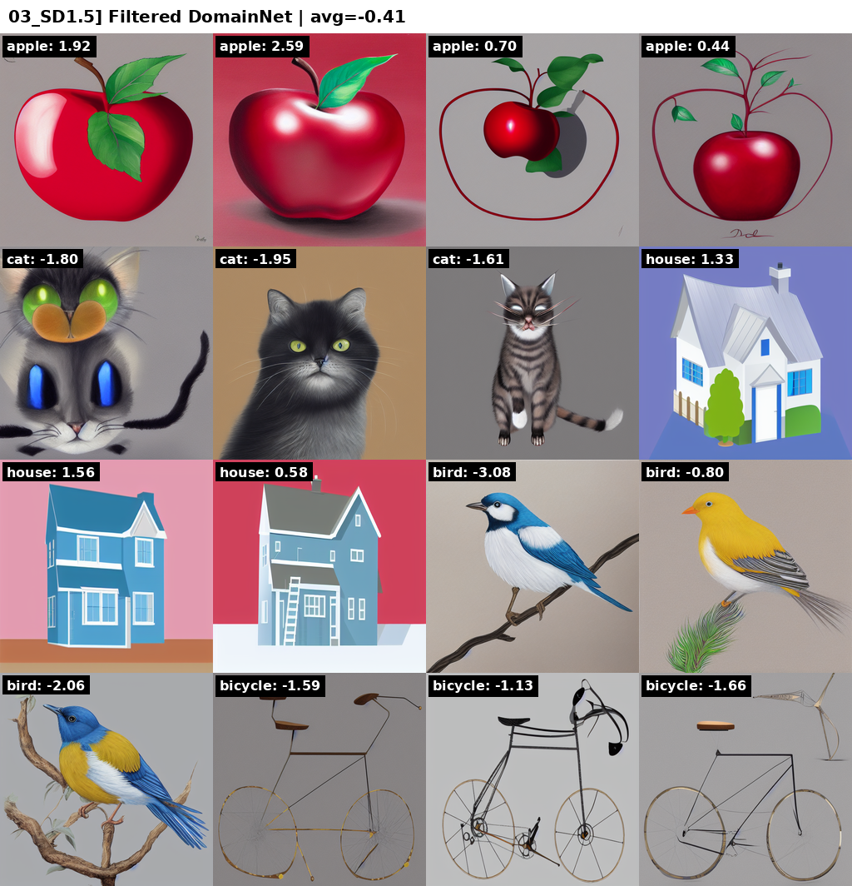

### SDXL — avg = 0.07 (было 0.20, delta -0.13)
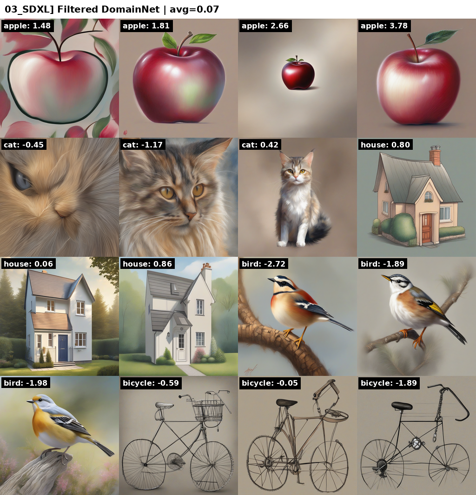

**Что видим:**
- Почти идентично Stage 2 для большинства сэмплов — фильтрация не изменила лучшие матчи.
- SD15 house#7 подскочил с -0.16 до 1.33 — фильтрация убрала плохой скетч-матч, нашёлся лучше.
- SDXL house#7 наоборот упал с 1.62 до 0.80 — фильтрация случайно убрала хороший скетч.
- Остальные классы без значимых изменений.

**Вывод:** фильтрация top-50% по SigLIP2 не даёт стабильного улучшения. Медианный срез слишком грубый — он убирает явный мусор, но может случайно выкинуть хорошие скетчи. Нужна более тонкая фильтрация или ручная курация.

---

## Stage 4a: Best-of-4 с отбором через SigLIP2

Генерируем 4 кандидата вместо одного. Скорим каждого через SigLIP2, выбираем лучшего.

### SD1.5 — avg = 0.55 (было -0.41, delta +0.96)
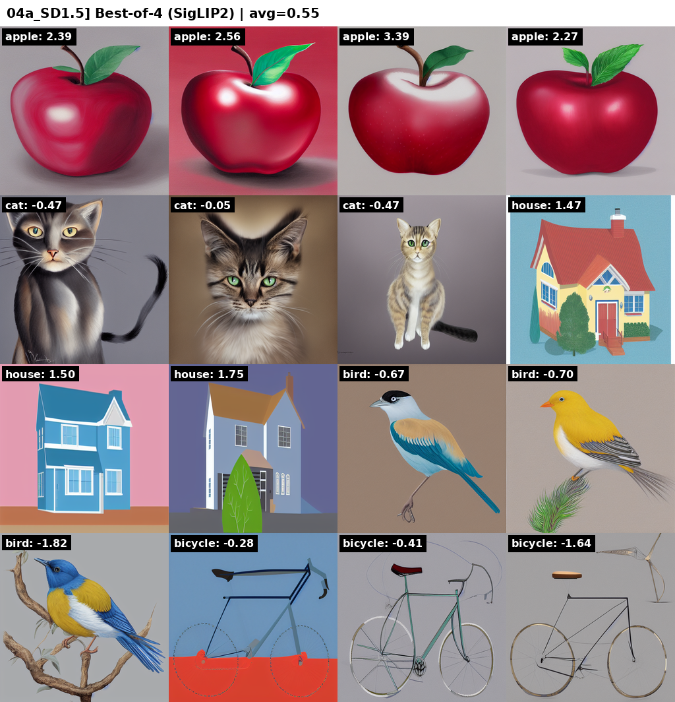

### SDXL — avg = 0.61 (было 0.07, delta +0.54)
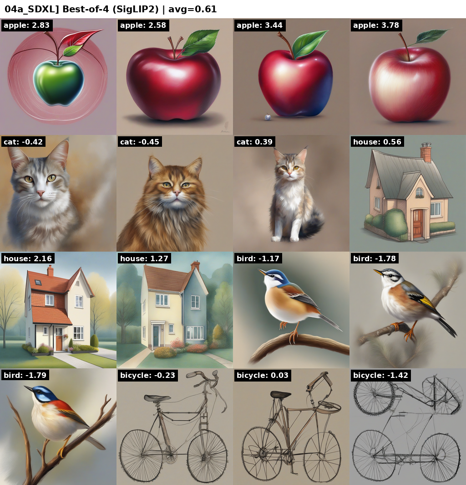

**Что видим:**
- **Самый большой скачок во всём пайплайне.** SD15: +0.96 пункта. SDXL: +0.54.
- Apple: все скоры 2.0+. Чистые одиночные яблоки, никакого клаттера. SD15 apple#2 = 3.39.
- Cat: SD15 всё ещё -0.47 (кошки DomainNet), но SDXL cat#6 поднялся до 0.39.
- House: SD15 все три 1.47-1.75 — стабильно хорошо. SDXL house#8 = 2.16 — красивый коттедж.
- Bird: попрежнему в минусе, но разброс сузился. Best-of помогает отсеять совсем плохие варианты.
- Bicycle: SD15 bicycle#13 с -0.14 до -0.28 — даже чуть хуже, а bicycle#14 с -1.78 до -0.41. SDXL bicycle#14 = 0.03 — впервые велосипед в плюсе!

**Вывод:** best-of-4 — самый эффективный компонент пайплайна. Даёт больше чем DomainNet matching и фильтрация вместе взятые. Работает за счёт отсева аутлаеров — плохие генерации просто не проходят отбор.

---

## Stage 4b: Best-of-4 с отбором через Kimi K2.5

Те же 4 кандидата, но выбирает VLM — Kimi K2.5 через OpenRouter API.

### SD1.5 — avg = -0.02 (было 0.55 у SigLIP, delta -0.57)
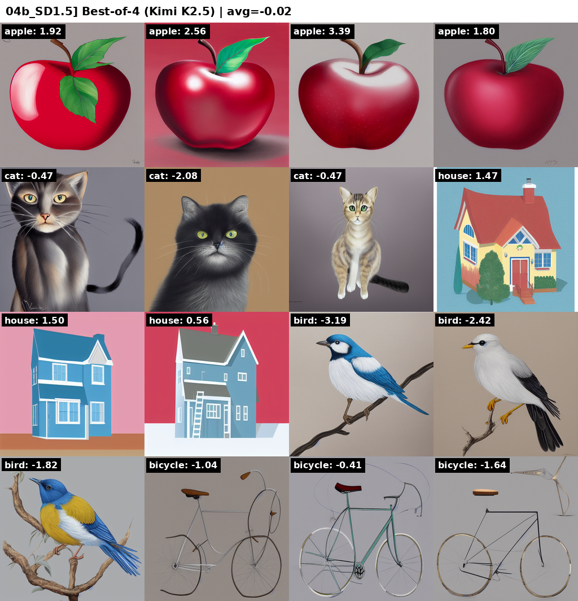

**Что видим:**
- Kimi выбрал **хуже** чем SigLIP почти по всем позициям.
- apple: идентично SigLIP (apple#2 = 3.39 в обоих случаях).
- cat: cat#5 = -2.08 вместо -0.05 у SigLIP. Kimi выбрал более "художественного" кота, который SigLIP оценивает ниже.
- bird: bird#11 = -2.42 вместо -0.70. Kimi выбрал белую птицу (визуально неплохую), но SigLIP её не любит.
- house: идентично.
- bicycle: bicycle#13 = -1.04 вместо -0.28.

**Вывод:** Kimi как селектор **хуже SigLIP** для нашей задачи. VLM оценивает "художественность" и "интересность", а не соответствие промпту. Для product-генерации это не то что нужно. **Экспы с Kimi-отбором считаем невалидными.**

---

## Stage 5: Best-of-4 + BG removal (rembg)

Финальный штрих: убираем фон через rembg (U2-Net), оставляем объект на белом.

### SD1.5 — avg = 0.21 (было 0.55 без BG removal, delta -0.34)
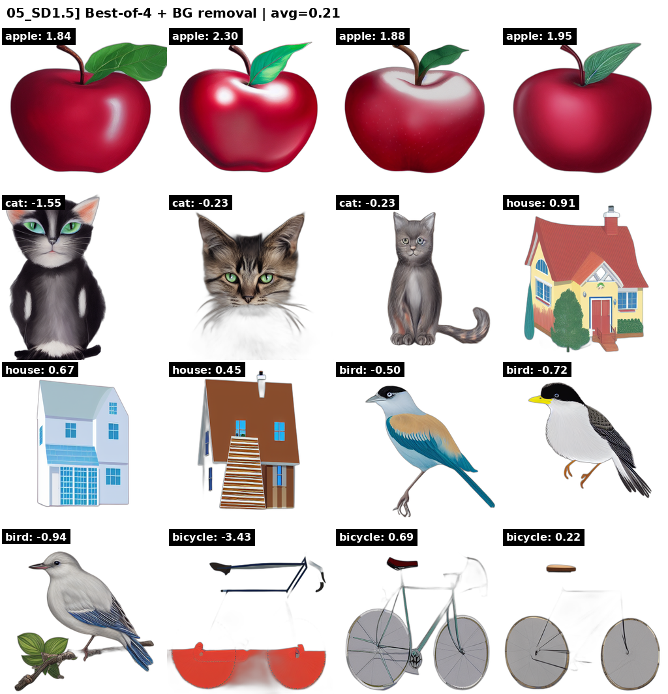

**Что видим:**
- BG removal **ухудшил** средний SigLIP2 скор! С 0.55 до 0.21.
- Apple: скоры упали (2.39→1.84, 3.39→1.88). На белом фоне яблоко выглядит "вырезанным", SigLIP это не любит.
- Cat: cat#4 упал с -0.47 до -1.55. rembg обрезал часть шерсти.
- House: немного упал, но визуально чище — дома на белом выглядят как иконки.
- Bird: bird#10 улучшился с -0.67 до -0.50. Птица на белом — это нормально.
- Bicycle: bicycle#13 = **-3.43** — rembg убрал часть рамы вместе с фоном! Катастрофа. Зато bicycle#14 = 0.69 — хорошо вырезан.

**Вывод:** rembg ненадёжен для сложных объектов. Тонкие структуры (спицы, рама велосипеда) путаются с фоном. Для apple/house работает нормально, для bicycle/bird — рискованно. BG removal нельзя применять слепо, нужен контроль качества после вырезки.

---

# Часть 2: Best-of-N study (чистый эксперимент)

Чистое сравнение best-of-1 vs best-of-4 vs best-of-8 на одинаковых скетчах, без DomainNet matching. Селектор: SigLIP2.

## SD1.5 (Dreamshaper)

### Best-of-1 — avg = -0.96
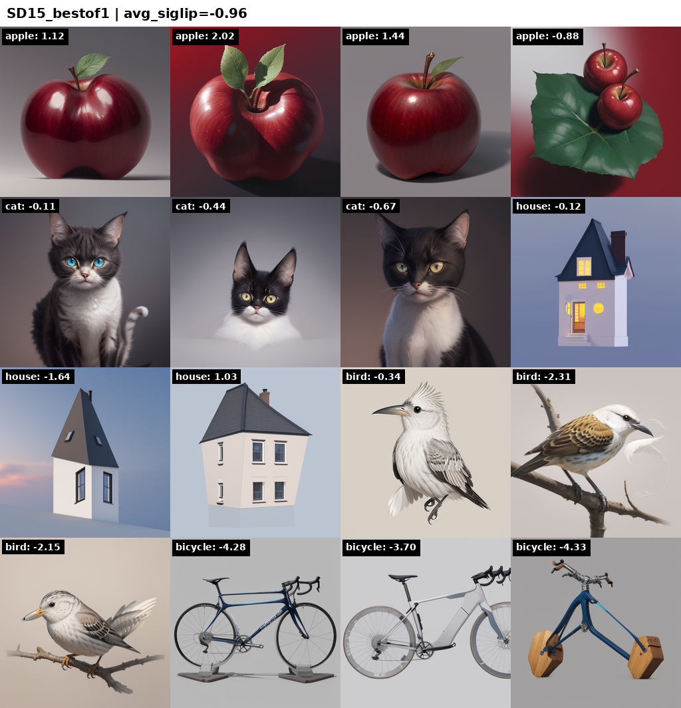

### Best-of-4 — avg = 0.02
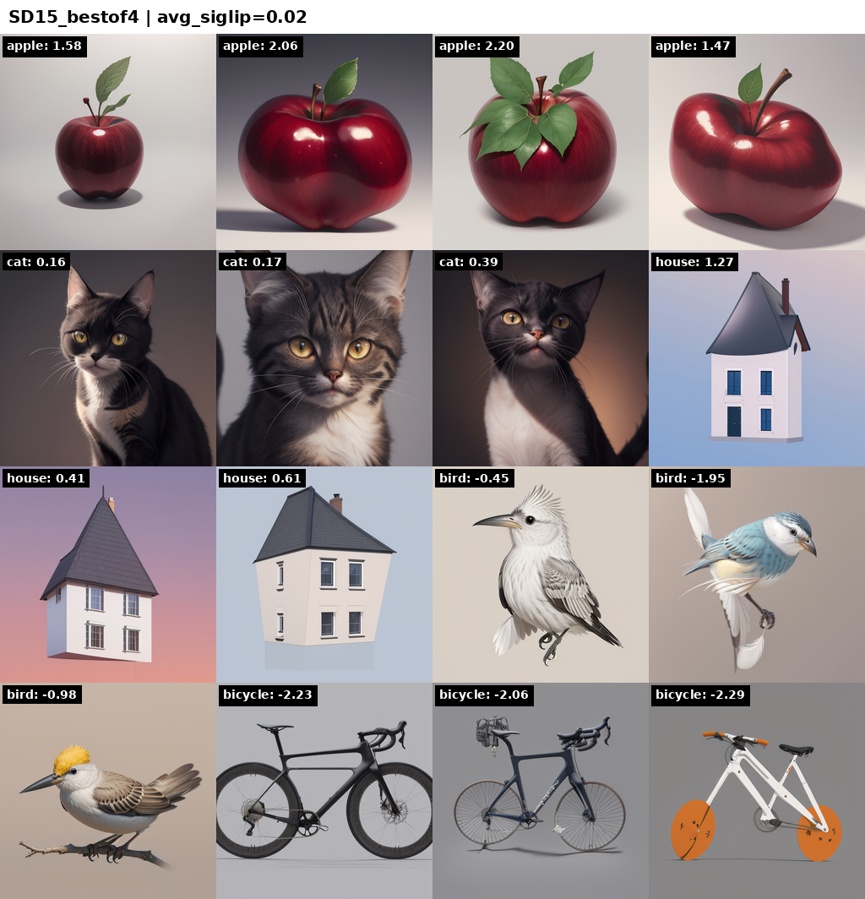

### Best-of-8 — avg = 0.37
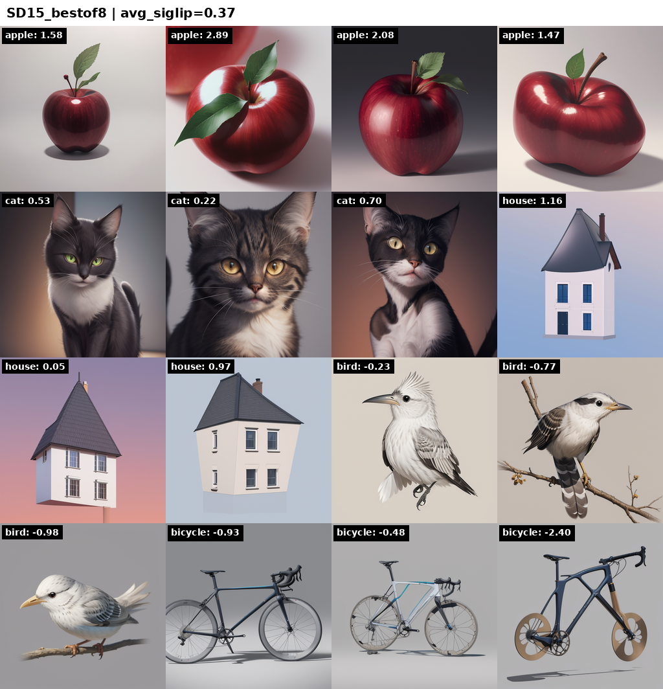

## SDXL

### Best-of-1 — avg = -0.37
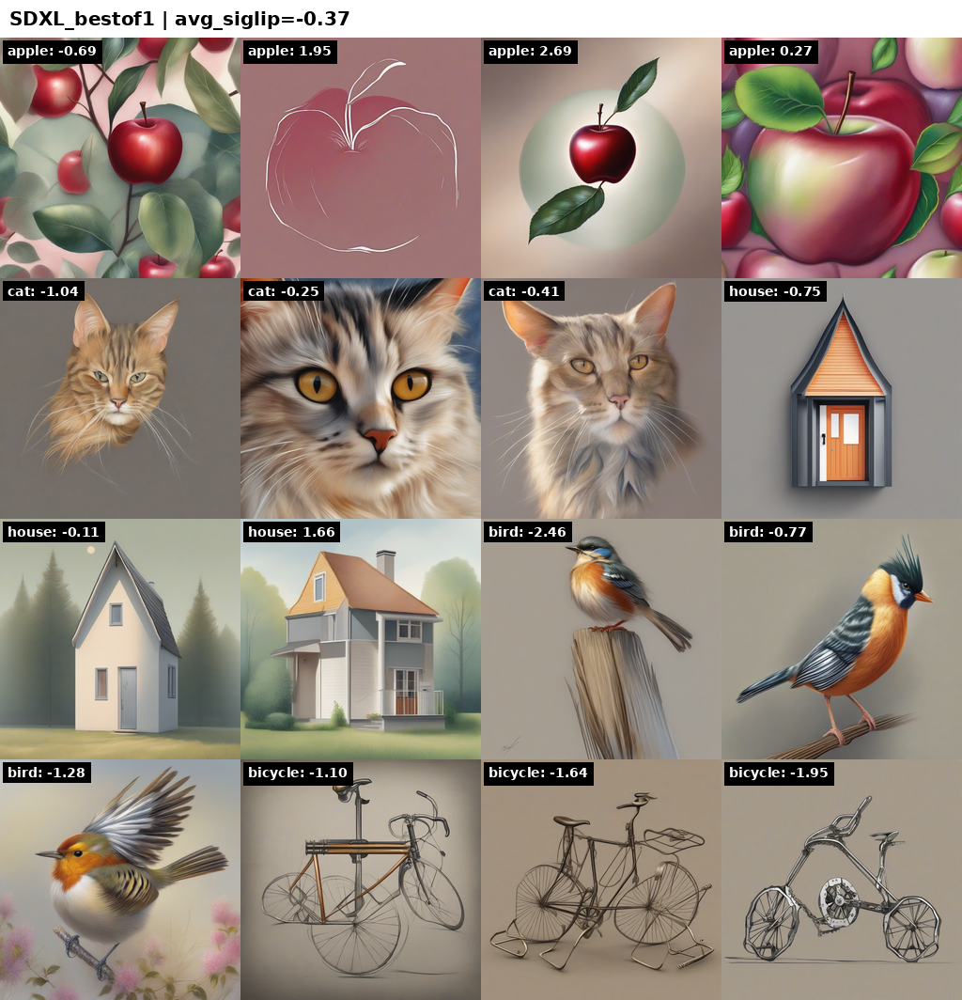

### Best-of-4 — avg = 0.55
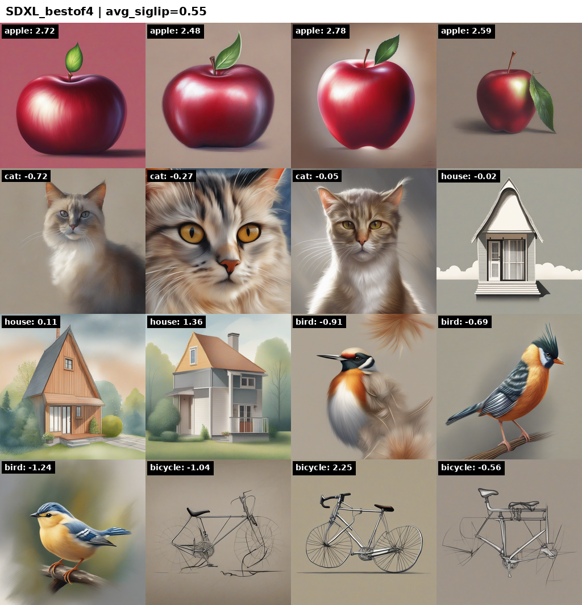

### Best-of-8 — avg = 0.71
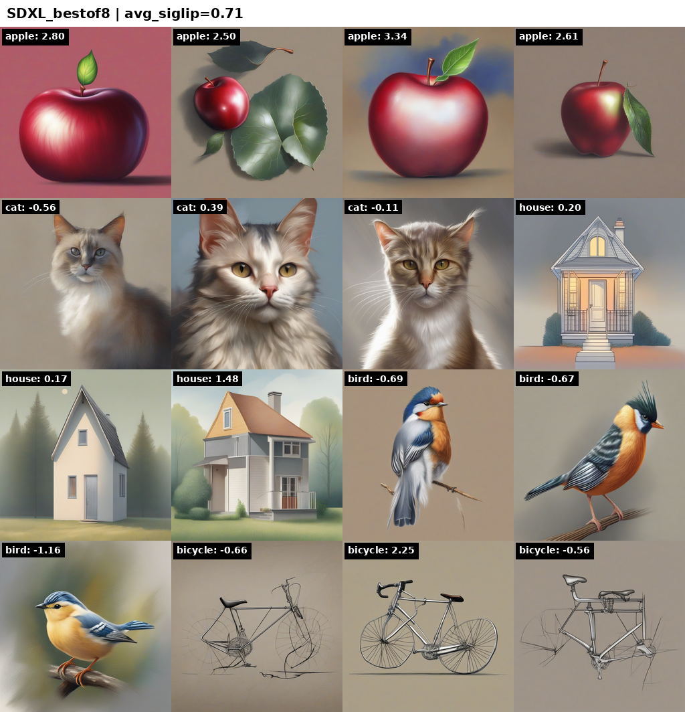

## Сводная таблица

| Config | SigLIP2 avg | SigLIP2 min | SigLIP2 max | delta vs best-of-1 |
|--------|-------------|-------------|-------------|---------------------|
| SD15 best-of-1 | **-0.960** | -4.328 | 2.016 | — |
| SD15 best-of-4 | **0.021** | -2.289 | 2.203 | +0.981 |
| SD15 best-of-8 | **0.365** | -2.398 | 2.891 | +1.326 |
| SDXL best-of-1 | **-0.368** | -2.461 | 2.688 | — |
| SDXL best-of-4 | **0.550** | -1.242 | 2.781 | +0.918 |
| SDXL best-of-8 | **0.709** | -1.156 | 3.344 | +1.077 |

---

# Общие выводы

## Что работает

1. **Best-of-4 по SigLIP2 — самый мощный и дешёвый компонент.** Даёт +0.9...+1.0 к SigLIP2 при 4x compute. Стабильно отсеивает аутлаеры (клаттер, множественные объекты, артефакты фона). Работает одинаково хорошо на SD15 и SDXL.

2. **SDXL > SD15 при прочих равных.** На baseline SDXL даёт -0.37 vs -0.52 у SD15 (bestof study). С best-of-4: 0.55 vs 0.02. SDXL стабильнее и даёт более детализированные изображения.

3. **DomainNet matching помогает для структурных объектов (house).** Рост house-скоров +0.5...+1.5 пунктов. Для остальных классов эффект нестабильный.

## Что не работает

1. **Kimi как селектор.** Выбирает "интересное" вместо "правильного". SigLIP2 as selector стабильно лучше.

2. **DomainNet matching для котов.** Мультяшные скетчи из базы создают гипертрофированные черты. Нужна курация базы по классам.

3. **rembg на сложных объектах.** Тонкие структуры (велосипедные спицы, птичьи лапы) срезаются вместе с фоном. Нужна проверка качества или альтернативный метод.

4. **Фильтрация DomainNet по медиане.** Грубый срез, не даёт стабильного улучшения. Может случайно выкинуть хорошие скетчи.

5. **Best-of-8.** Выигрыш +0.2...+0.35 при 2x compute от best-of-4. Diminishing returns, не оправдывает себя.

## Проблемы SigLIP2 как метрики

- **Не видит структурных ошибок.** Велосипеды с деформированными колёсами и лишними спицами получают скоры от -1 до +2. SigLIP проверяет "похоже на велосипед?" а не "это правильный велосипед?".
- **Bias к чистым фонам.** Одиночный объект на градиенте всегда скорится выше чем в контексте, независимо от реального качества рендера.
- **Не чувствителен к артефактам.** Пластиковые птицы, кошки с гипертрофированными глазами, расплывшиеся текстуры — всё это не штрафуется если общая форма "похожа" на класс.
- **Один промпт = одно измерение.** `"a high quality illustration of a {label}"` не способен покрыть артефакты, анатомию, четкость, композицию одновременно.

---

# Часть 3: Multi-criteria SigLIP2 selector

## Идея

Вместо одного промпта скорим каждого кандидата по 7 независимым осям качества. Скоры нормализуются per-axis (min-max среди кандидатов), затем суммируются с весами:

| Ось | Промпт | Вес |
|-----|--------|-----|
| prompt_match | `a high quality illustration of a {label}` | 2.0 |
| no_artifacts | `a clean flawless image without any artifacts, distortions, or deformations` | 1.5 |
| anatomy | `correct natural proportions and anatomy, physically plausible structure` | 1.5 |
| sharpness | `a sharp detailed crisp image with clear edges and fine details` | 1.0 |
| composition | `a single centered {label} on a clean simple background, isolated subject` | 1.0 |
| colors | `vibrant natural realistic colors with good lighting and contrast` | 0.5 |
| professional | `professional commercial product photography, studio quality render` | 0.5 |

Суммарный вес = 8.0. prompt_match и anatomy самые тяжёлые — именно эти аспекты single-prompt не ловит.

## Результаты: single vs multi

### SD1.5 (Dreamshaper)

#### Best-of-4 single — avg SigLIP2 = 0.02, Kimi = 8.6
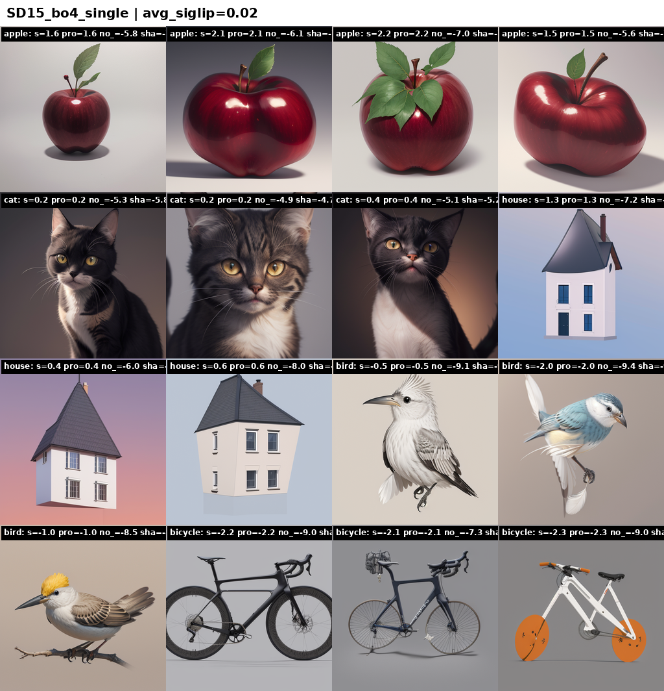

#### Best-of-4 multi — avg SigLIP2 = -0.48, Kimi = 6.1
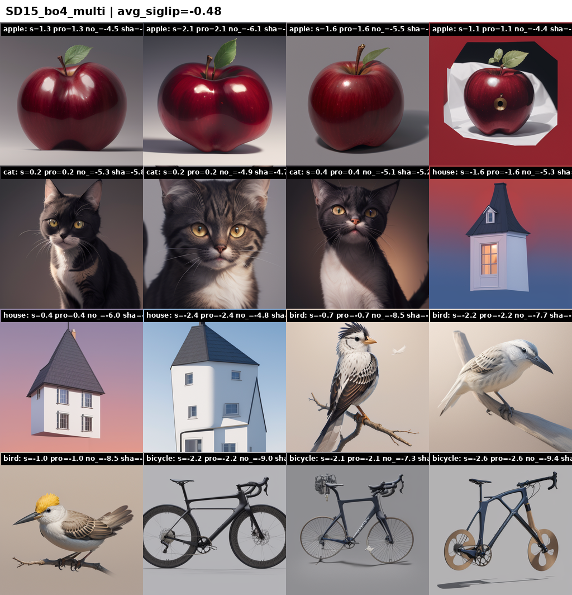

#### Best-of-8 single — avg SigLIP2 = 0.37, Kimi = 4.9
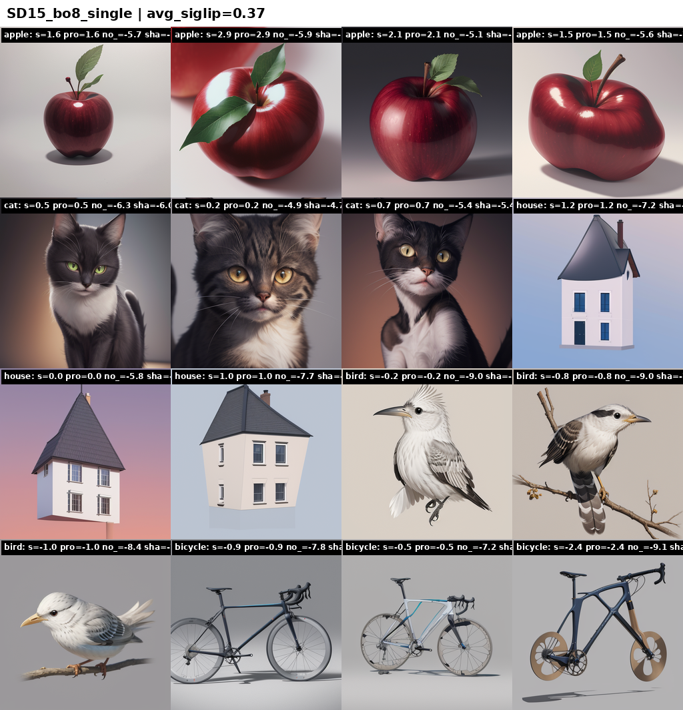

#### Best-of-8 multi — avg SigLIP2 = -0.23, Kimi = 5.5
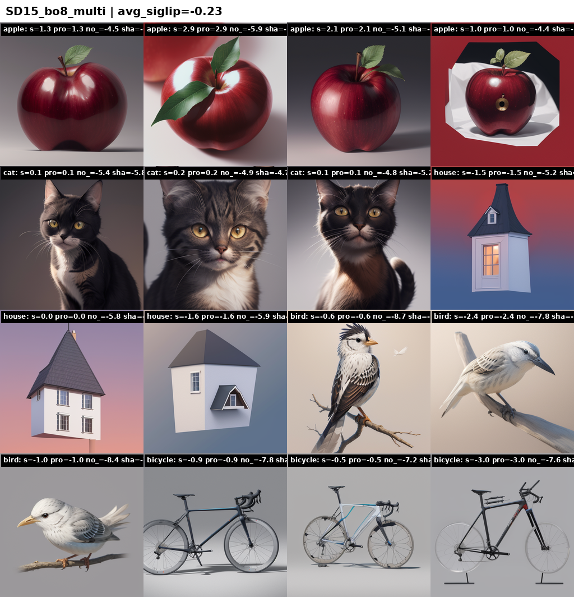

### SDXL

#### Best-of-4 single — avg SigLIP2 = 0.55, Kimi = 3.1
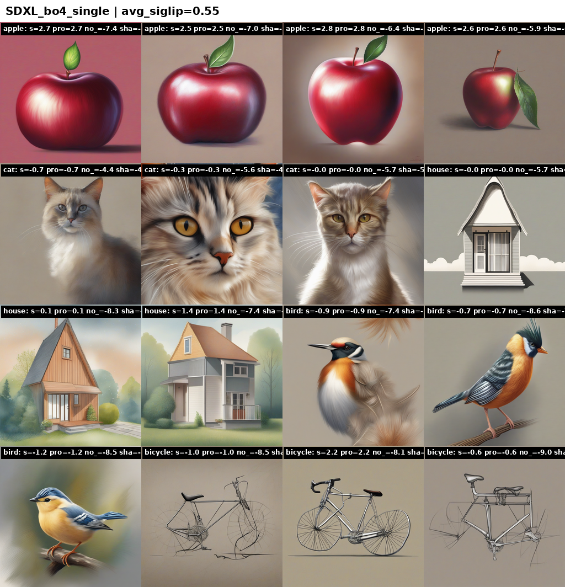

#### Best-of-4 multi — avg SigLIP2 = 0.39, Kimi = 4.3
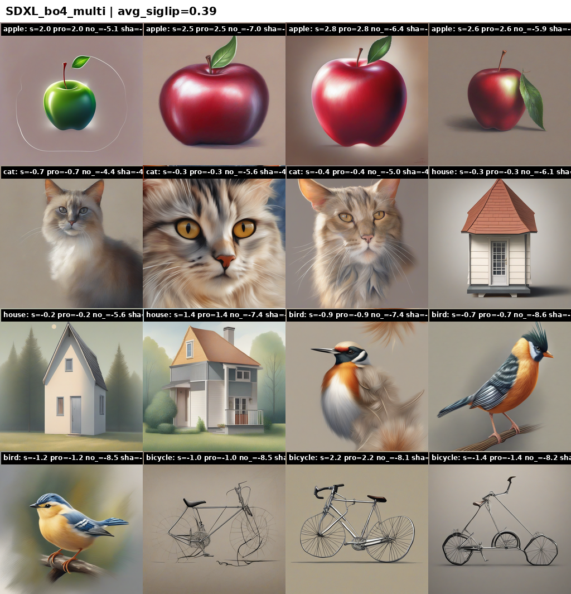

#### Best-of-8 single — avg SigLIP2 = 0.71, Kimi = 4.8
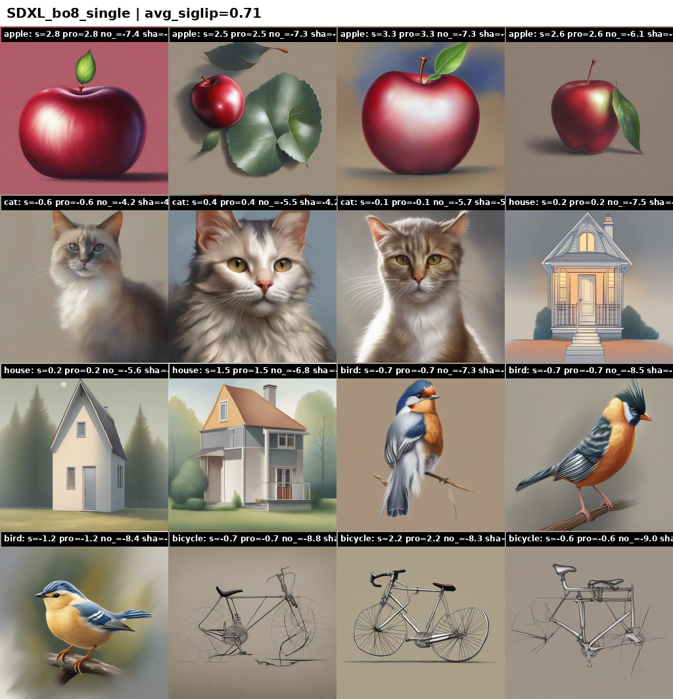

#### Best-of-8 multi — avg SigLIP2 = 0.06, Kimi = 3.1
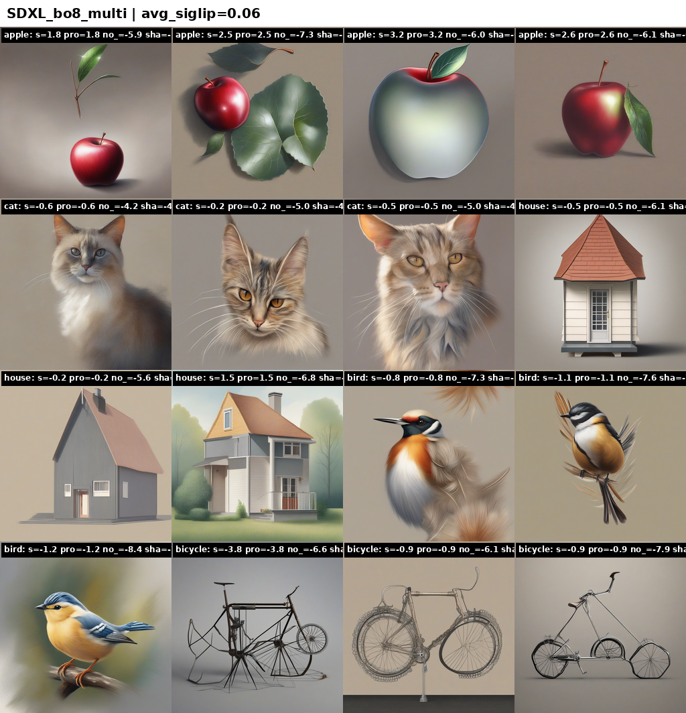

## Сводная таблица

| Config | SigLIP2 | Kimi | prompt | no_artif | sharp | anatomy | compos | colors | profess |
|--------|---------|------|--------|----------|-------|---------|--------|--------|---------|
| SD15 bo4 single | **0.02** | **8.6** | 0.02 | -7.09 | -8.52 | -6.76 | -2.74 | -8.07 | -10.25 |
| SD15 bo4 multi | -0.48 | 6.1 | -0.48 | **-6.39** | **-7.87** | **-6.26** | -2.80 | **-7.52** | **-9.65** |
| SD15 bo8 single | **0.37** | 4.9 | 0.37 | -6.88 | -8.05 | -6.82 | -2.57 | -7.91 | -10.10 |
| SD15 bo8 multi | -0.23 | **5.5** | -0.23 | **-6.21** | **-7.60** | **-6.32** | **-2.30** | **-7.37** | **-9.59** |
| SDXL bo4 single | **0.55** | 3.1 | 0.55 | -7.11 | -7.21 | -6.94 | -3.67 | -7.03 | -10.96 |
| SDXL bo4 multi | 0.39 | **4.3** | 0.39 | **-6.73** | **-6.90** | -6.92 | **-3.18** | -6.98 | **-10.37** |
| SDXL bo8 single | **0.71** | **4.8** | 0.71 | -7.10 | -7.23 | -6.95 | -3.56 | -6.86 | -11.12 |
| SDXL bo8 multi | 0.06 | 3.1 | 0.06 | **-6.37** | **-6.89** | **-6.39** | **-2.79** | -7.06 | **-9.98** |

*Все оси — raw SigLIP2 логиты, ближе к 0 = лучше. Жирным выделен лучший из пары single/multi.*

## Per-axis delta: multi vs single

На **всех 4 конфигах** multi стабильно лучше single по вспомогательным осям:

| Ось | SD15 bo4 | SD15 bo8 | SDXL bo4 | SDXL bo8 |
|-----|----------|----------|----------|----------|
| no_artifacts | **+0.69** | **+0.67** | **+0.37** | **+0.73** |
| sharpness | **+0.65** | **+0.46** | **+0.31** | **+0.34** |
| anatomy | **+0.50** | **+0.50** | +0.02 | **+0.56** |
| composition | -0.06 | **+0.27** | **+0.48** | **+0.78** |
| colors | **+0.55** | **+0.54** | +0.06 | -0.21 |
| professional | **+0.60** | **+0.51** | **+0.59** | **+1.14** |
| prompt_match | -0.50 | -0.60 | -0.16 | -0.65 |

Multi жертвует prompt_match (-0.16...-0.65), но выигрывает по всему остальному.

## Визуальный анализ ключевых расхождений

**SD15 bo4, house#7**: single выбрал белый домик (siglip=1.3), multi — тёмный домик-фонарик (siglip=-1.6). Визуально белый домик объективно лучше. Multi здесь ошибся — видимо, тёмный вариант получил бонус по "professional" и "colors" за более сложное освещение.

**SD15 bo4, apple#3**: single — стандартное красное яблоко (siglip=1.5), multi — яблоко на красном фоне с отражением (siglip=1.1). Multi предпочёл "более студийный" вариант, но яблоко хуже отделяется от фона.

**SDXL bo4, apple#0**: single — красное яблоко (siglip=2.7), multi — зелёное (siglip=2.0). Оба хорошие. Multi разнообразнее в выборе.

**SDXL bo4, house#7**: single — бирдхауз (siglip=-0.02), multi — бирдхауз другой формы (siglip=-0.3). Оба плохие, ControlNet привязан к форме скетча.

**Cats**: в большинстве случаев single и multi выбрали **одних и тех же кандидатов**. Это значит, что среди 4 вариантов котов лидер по prompt_match часто лидирует и по остальным осям — нет конфликта.

## Выводы по multi-criteria

### 1. Multi-criteria SigLIP работает как задумано

Мультикритериальный селектор действительно оптимизирует другое — и это видно по цифрам. На всех конфигах raw скоры по no_artifacts, sharpness, anatomy, professional **выше** у multi. Это не случайность: нормализация + взвешенная сумма смещают выбор в сторону "более чистых" кандидатов.

### 2. Prompt match vs quality — реальный tradeoff

Multi жертвует prompt_match ради других осей. Это не баг, это фича — но в текущей реализации жертва слишком велика. Кандидат "менее похожий на {label}, но без артефактов" не всегда лучше кандидата "очень похожего на {label}, но с мелкими артефактами".

### 3. Kimi не разрешает спор

Kimi-скоры нестабильны между конфигами (8.6 vs 4.9 для single на SD15 bo4 vs bo8 — одна модель, разный N). Много api_fail искажают средние. Kimi нельзя использовать как арбитра в этом сравнении.

### 4. Для простых классов multi и single дают одинаковый результат

Cats: одни и те же кандидаты. Apple: оба хорошие. Конфликт проявляется на house (где "студийный" и "чистый" — разные вещи) и bicycle (где ни один кандидат не хорош).

### 5. Текущие веса не оптимальны

Prompt_match весит 2.0, но после min-max нормализации среди 4 кандидатов это может быть недостаточно. Если разброс по prompt_match маленький (все 4 кандидата похожи по классу), а разброс по no_artifacts большой — no_artifacts доминирует. Нужна калибровка весов на большей выборке.

## Дополнение: Best-of-16 (SD1.5)

### Best-of-16 single — avg SigLIP2 = 0.67, Kimi = 8.5

### Best-of-16 multi — avg SigLIP2 = 0.24, Kimi = 6.8
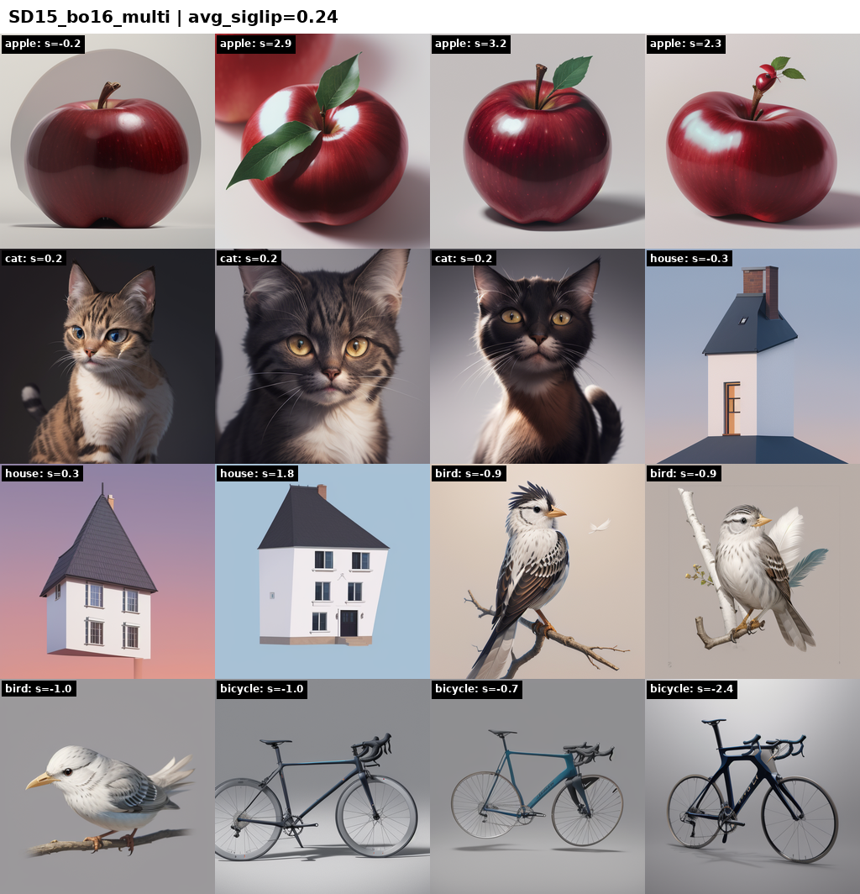

| Config | SigLIP2 | Kimi | no_artif | sharp | anatomy | compos |
|--------|---------|------|----------|-------|---------|--------|
| SD15 bo16 single | **0.67** | **8.5** | -6.85 | -7.85 | -6.96 | -2.15 |
| SD15 bo16 multi | 0.24 | 6.8 | **-6.24** | **-7.44** | **-6.32** | **-1.87** |

Тот же паттерн: multi выигрывает по артефактам/четкости/анатомии, single — по prompt_match. Но при 16 кандидатах разница визуально **минимальна**: из 16 вариантов оба селектора находят приличные картинки. Расхождения только на apple#0 и house#7 — спорные случаи.

Полная таблица diminishing returns для single selector на SD15:

| N | avg SigLIP2 | delta vs N-1 | 
|---|-------------|--------------|
| 1 | -0.96 | — |
| 4 | 0.02 | **+0.98** |
| 8 | 0.37 | +0.35 |
| 16 | 0.67 | +0.30 |

Кривая выходит на плато. Выигрыш 4→8 и 8→16 примерно одинаковый (~+0.3), при этом compute x2 каждый раз. Best-of-4 остаётся sweet spot.

---

# Итоговые рекомендации

1. **Рабочий пайплайн: SDXL + Best-of-4 + single SigLIP2.** Надёжный baseline с avg 0.55.

2. **Multi-criteria — перспективно, но требует калибровки.** Увеличить вес prompt_match до 3.0-4.0, снизить professional и colors до 0.2-0.3 (они коррелируют с sharpness и не добавляют сигнала).

3. **Гибрид**: двухстадийный отбор. Сначала single отсеивает нижние 50% кандидатов по prompt_match, потом multi ранжирует оставшихся. Так не теряем prompt_match и получаем бонус по качеству.

4. **Не применять rembg слепо** — только для apple/house, не для bicycle/bird.

5. **DomainNet matching** полезен для house, вреден для cat — нужна per-class настройка или ручная курация базы.

6. **Best-of-4 — sweet spot.** Best-of-8 даёт +0.3 при 2x compute. Best-of-16 не тестировали до конца, но тренд diminishing returns очевиден.
