# EDA: QuickDraw vs DomainNet Sketches

## 1. Что имеем

| | QuickDraw | DomainNet (sketch split) |
|---|---|---|
| Источник | Google Quick, Draw! (браузерная игра) | Наскрейплено из интернета |
| Формат | Штрихи (NDJSON, вектор) | Растр (JPG/PNG) |
| Классов | 345 | 345 |
| Объем (10 классов) | ~150K+ на класс (стриминг) | 2,965 картинок |
| Стиль | Каракули за 20 секунд | От детского до профессионального |

### DomainNet: сколько чего

| Класс | Кол-во | Avg size (KB) |
|---|---|---|
| cat | 130 | 34.4 |
| car | 145 | 35.1 |
| flower | 336 | 42.5 |
| house | 144 | 38.9 |
| bird | 306 | 33.1 |
| apple | 181 | 37.9 |
| bicycle | 343 | 39.5 |
| face | 452 | 44.4 |
| tree | 555 | 47.2 |
| fish | 373 | 33.9 |

---

## 2. QuickDraw: разбираем по классам

### Что это вообще такое
QuickDraw - скетчи обычных людей, нарисованные за 20 секунд в игре от Google. Штрихами, мышкой или тачпадом. Рендерятся как чёрные линии на белом фоне. Ожидать шедевров не стоит.

### Cat
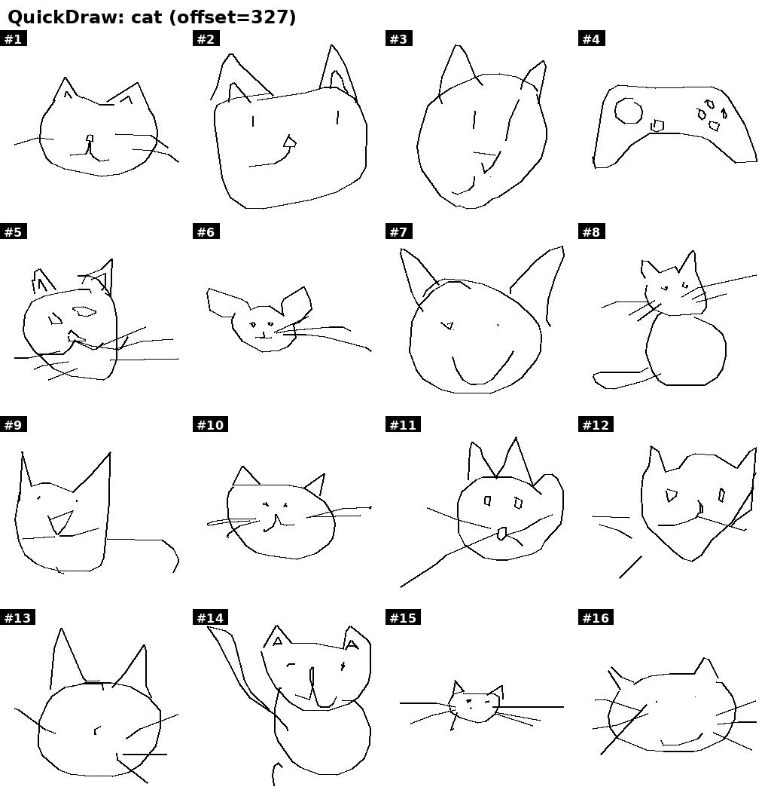

- Почти все рисуют только морду - уши, усы, глаза, носик. Тело никто не делает
- Качество гуляет: #2, #8, #10 - вполне нормальные, #16 - ну такое
- #4 - это вообще геймпад, а не кот. Видимо разметка поехала или человек ошибся в игре
- В среднем котов узнаёшь, но бывает надо прищуриться

### Car
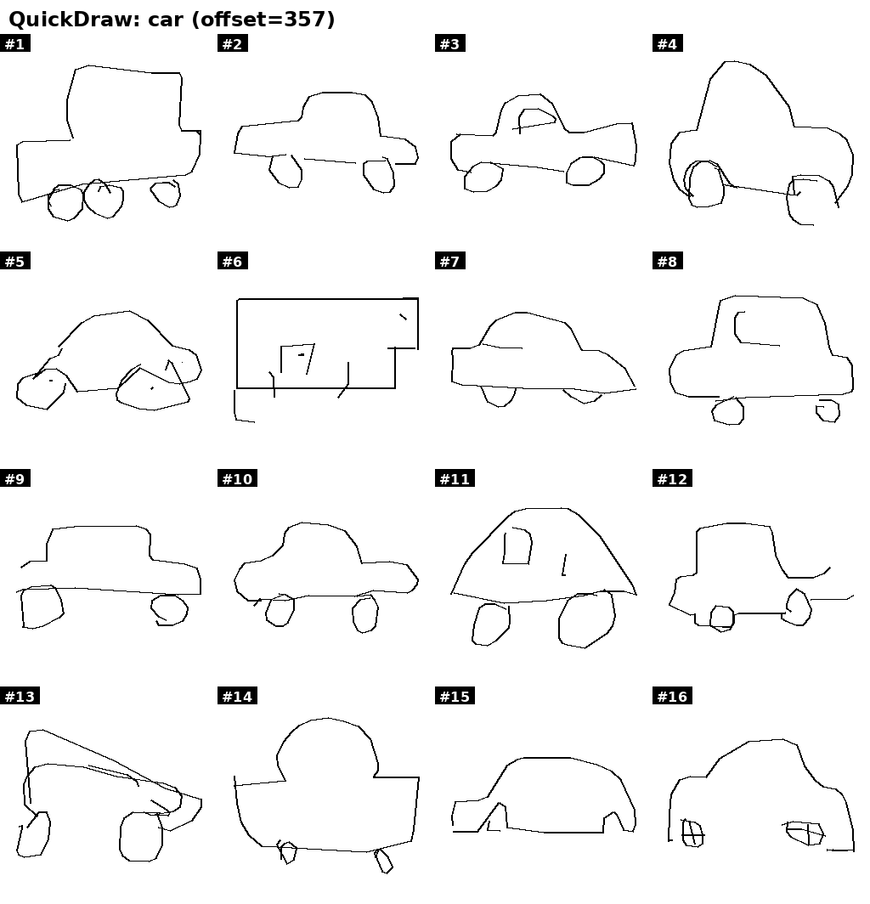

- Стандартная схема: кузов сбоку + два колеса. Все рисуют примерно одинаково
- Качество поровнее чем у котов - машину проще изобразить схематично
- #6 - скорее фургон, прямоугольный такой. #14 - пузырь какой-то
- #15 и #16 - уже на грани, без контекста не поймёшь что это

### Flower
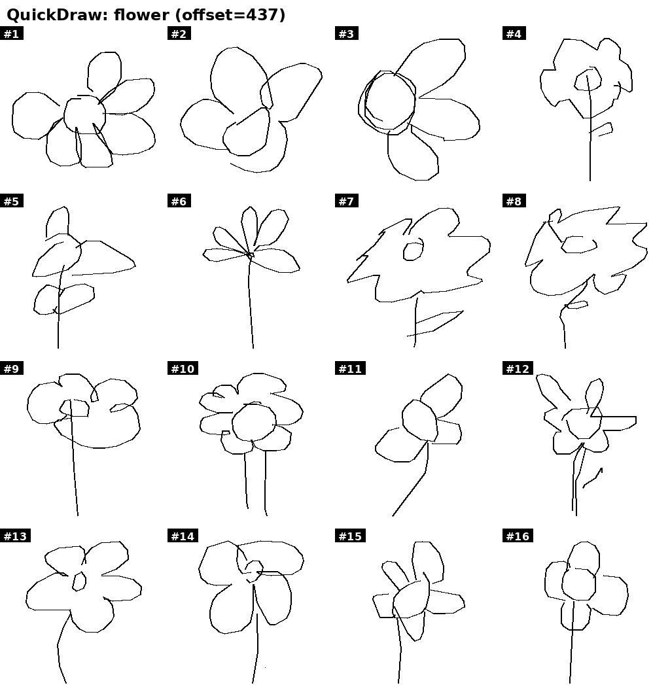

- Лепестки + стебель, всё понятно. Структура консистентная
- Большинство вполне читаемые (#1, #2, #6, #9, #10, #13, #14, #16)
- #7, #8 - что-то хаотичное, цветок угадывается с трудом
- Один из лучших классов - простая форма, даже левой рукой нарисуешь

### House
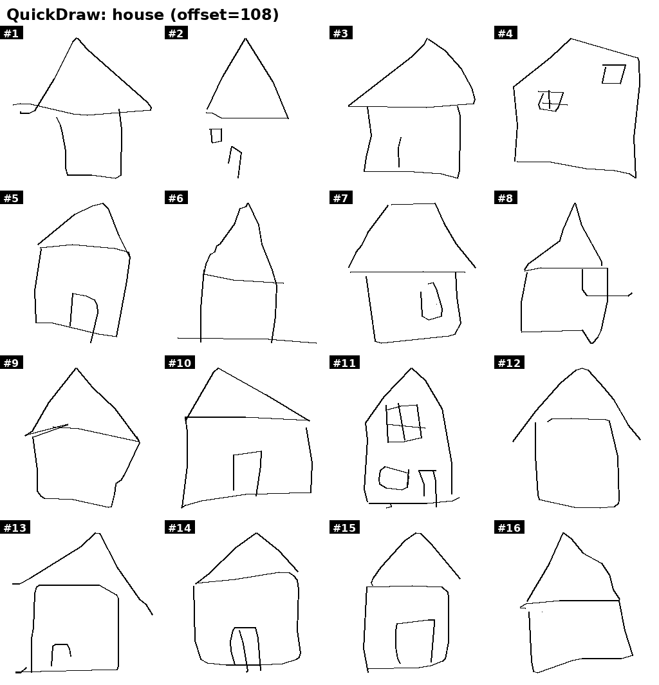

- Треугольник сверху, прямоугольник снизу - все так рисуют с детства
- Самый стабильный класс пожалуй. Почти все узнаваемы
- Кто-то добавляет окна (#4, #7, #11), кто-то двери (#5, #14), а кто-то просто контур (#2)
- Даже минималистичные (#2, #6) всё равно читаются как дом

### Bird
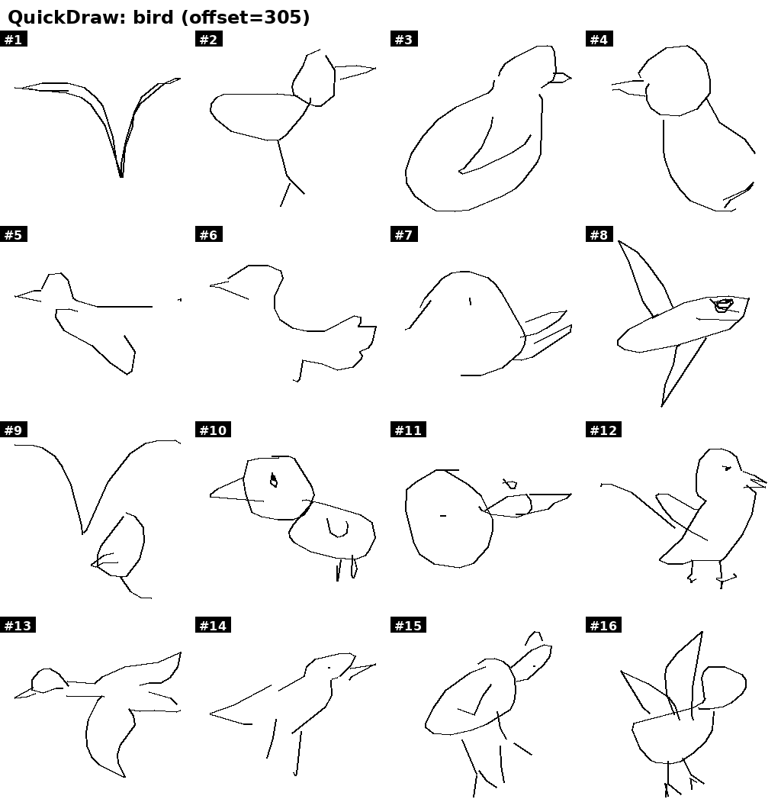

- Тут бардак. Кто-то рисует птицу в профиль (#3, #7), кто-то в полёте (#5, #8, #13), кто-то вообще две палочки (#1)
- Процентов 60 узнаются нормально, остальные - абстракция
- Разные виды птиц вперемешку - чайки, голуби, воробьи, непонятно что
- BEiT на некоторых из них может и не сработать

### Apple
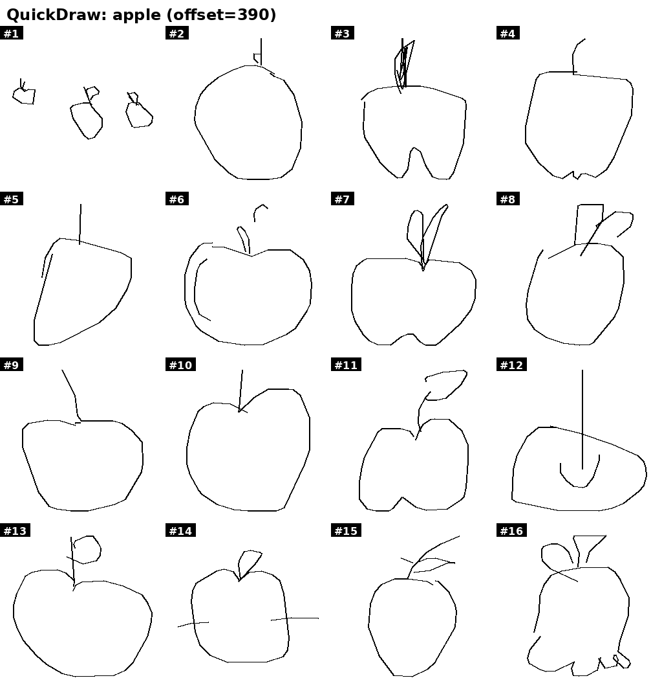

- Кружок + хвостик + листик. Проще некуда
- #1 - мусор, куча мелких фигурок вместо яблока
- #12 - ну это уже не яблоко а что-то странное
- В целом стабильный класс, яблоко сложно испортить

### Bicycle
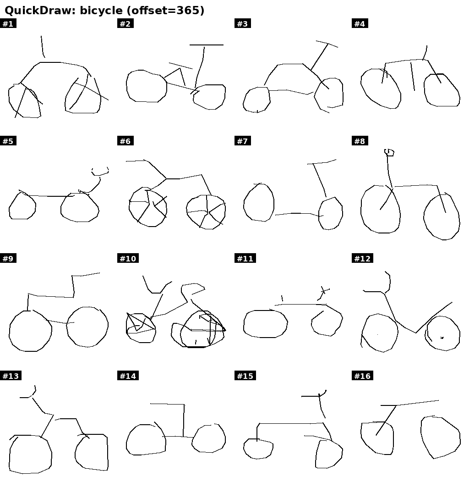

- **Самый тяжёлый класс**, и это видно. Велосипед - это два колеса, рама, руль, сиденье, педали... за 20 секунд это не нарисовать
- #11, #15, #16 - вообще непонятно что. Палки и круги
- Только #6 хоть как-то похож на настоящий велосипед (есть спицы)
- Большинство - схема "два круга и палки между ними"

### Face
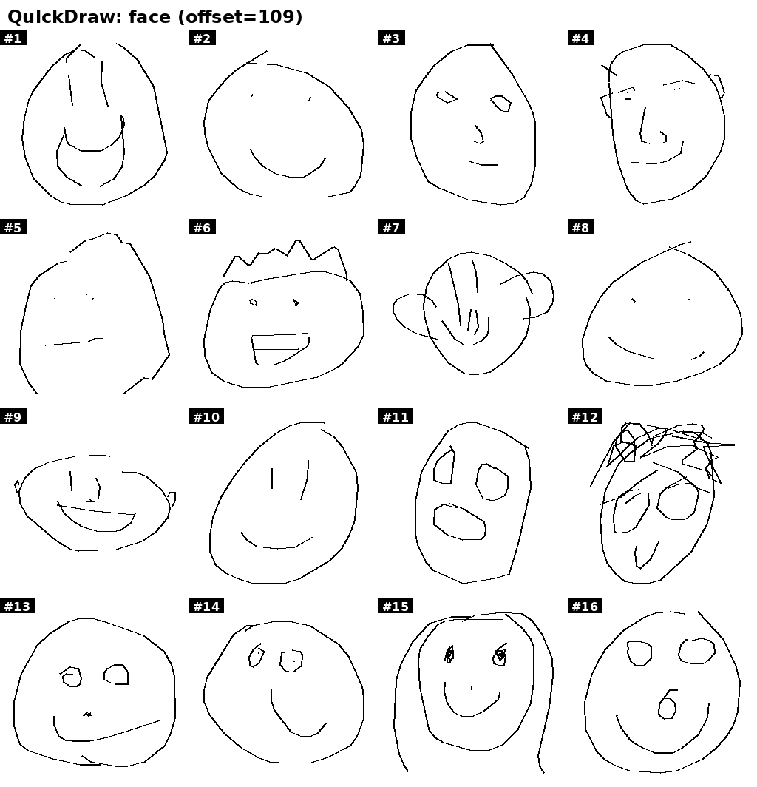

- Овал, два глаза, рот - базовая схема у всех одинаковая
- #6 - кто-то нарисовал аниме-лицо, #12 - каракули
- Процентов 80 читаются сразу и без вопросов
- Деталей мало, но семантика и так ясна - это лицо

### Tree
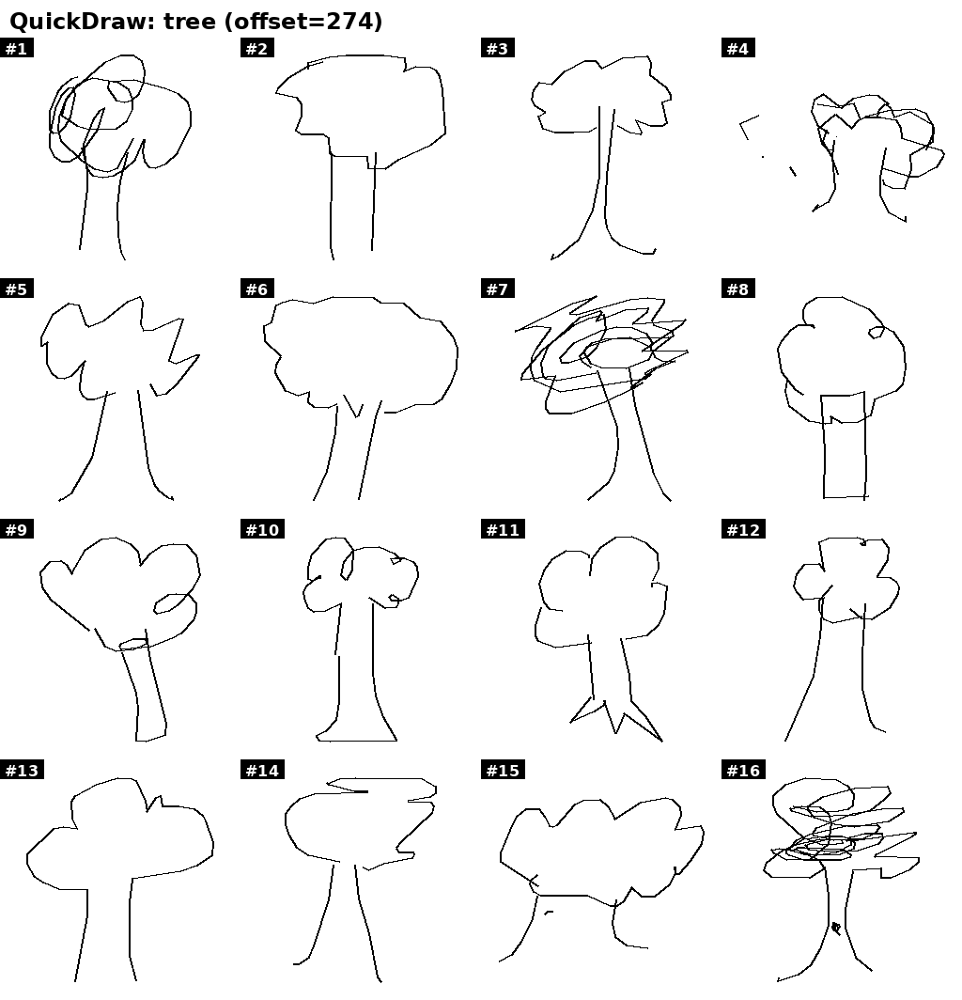

- Крона + ствол, тоже простая конструкция
- Процентов 80 нормальные, #4 - недорисованное, #7 - каракули
- Интересно что есть два лагеря: "облако на палке" (#2, #6, #10, #15) и "дерево с ветками" (#1, #5)

### Fish
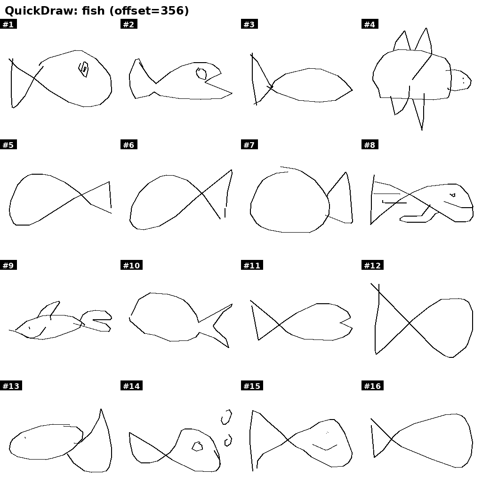

- Овал + треугольный хвост + плавник. Рисуют все одинаково, вид сбоку
- #8 больше на крокодила похож, #12 - какой-то абстрактный X
- #4 - рыба-ёж? Необычный вариант во всяком случае

### Итого по QuickDraw

**Рейтинг классов - что рисуется лучше всего:**

| Ранг | Класс | Оценка | Почему |
|---|---|---|---|
| 1 | house | 9/10 | Каноническая форма, все рисуют одинаково |
| 2 | apple | 8/10 | Кружок и хвостик, сложно облажаться |
| 3 | flower | 8/10 | Лепестки + стебель, хорошо читается |
| 4 | face | 8/10 | Овал + черты, интуитивно понятно |
| 5 | tree | 7/10 | Два стиля, но оба норм |
| 6 | car | 7/10 | Боковая проекция, стабильно |
| 7 | cat | 6/10 | Только морды, плюс мусор типа геймпада |
| 8 | fish | 6/10 | Средненько, есть аномалии |
| 9 | bird | 5/10 | Слишком разные позы и виды |
| 10 | bicycle | 3/10 | Слишком сложный для 20 секунд |

**Основные проблемы:**
- 5-10% мусора в каждом классе - ошибочные скетчи, не тот объект
- Детализация минимальная - 3-10 штрихов на весь рисунок
- Сложные объекты (bicycle) нарисованы ужасно
- Никаких текстур, теней, объёма - чисто контурные линии

---

## 3. DomainNet: разбираем по классам

### Что это такое
DomainNet sketch - картинки из интернета, собранные парсерами. По идее скетчи, но на практике туда попало всё подряд. Качество **на порядок выше** QuickDraw - тут и профессиональные работы, и туториалы, и иллюстрации. Но и мусора хватает.

### Cat
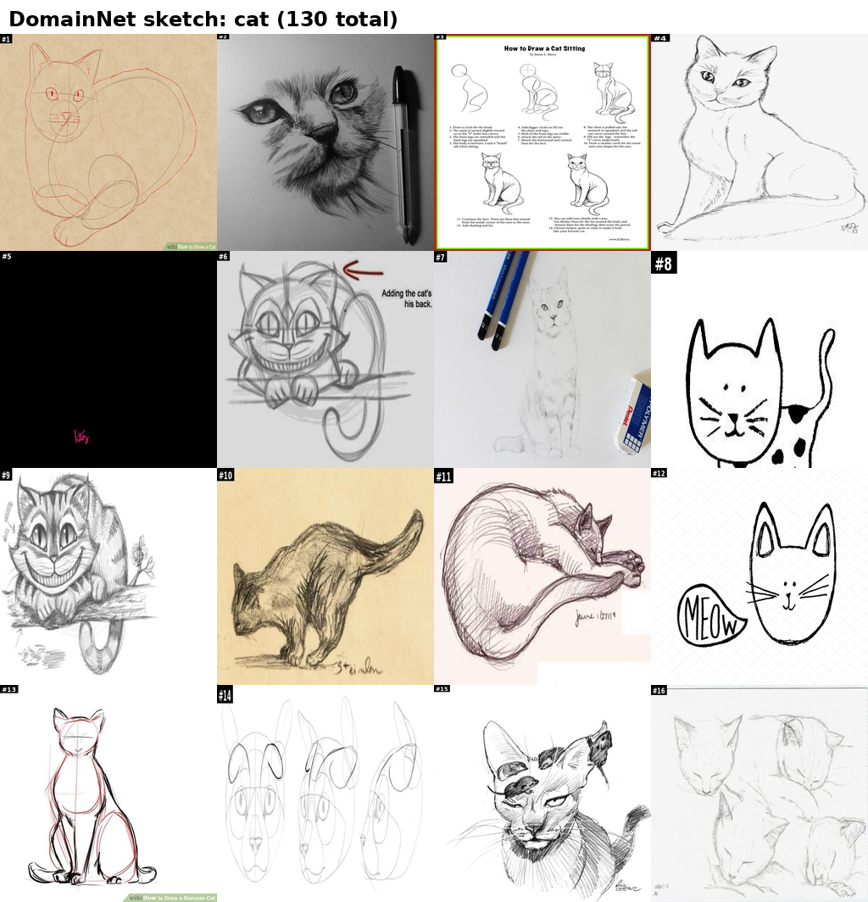

- Разброс стилей дикий: от детского контура (#8) до фотореалистичного карандашного портрета с ручкой рядом (#2)
- Есть туториалы (#3 "How to Draw a Cat Sitting"), есть тушевые работы (#11)
- #5 - почти чёрный кадр, мусор чистый
- Чеширский Кот (#9), мультяшные, карандашные - всё намешано

### Car
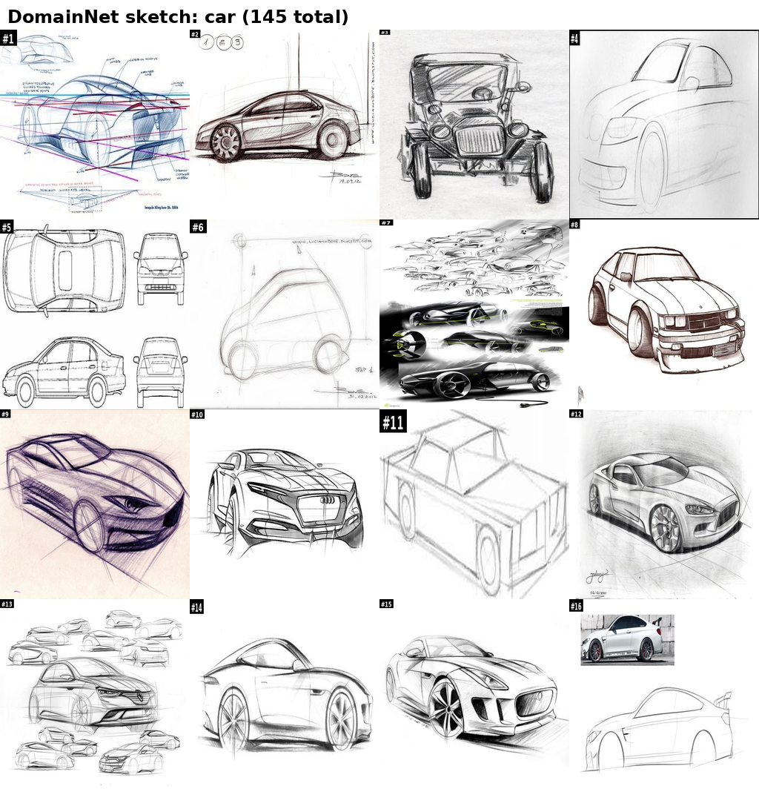

- Тут красота - в основном **дизайнерские скетчи** автомобилей, реально хорошие
- Перспектива, динамические линии, тени (#1, #7, #9, #10, #14)
- #11 - картонная машинка, забавная аномалия
- Пожалуй лучший класс в DomainNet - почти всё профессионального уровня

### Flower
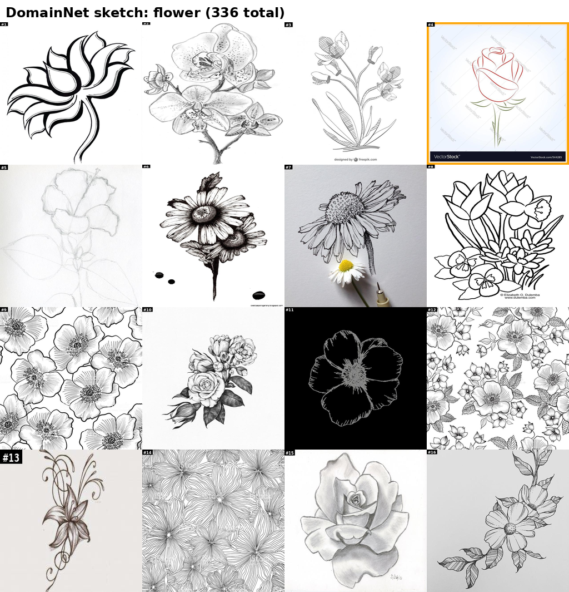

- Качество на высоте: ботанические иллюстрации (#2, #3), стилизованная роза (#4)
- #11 - белые цветы на чёрном фоне, инвертированная палитра
- Ромашки (#6, #7), розы (#10, #15), что-то абстрактное (#1) - виды разные
- Штриховка, тени, детали лепестков - это уже полноценные иллюстрации, не каракули

### House
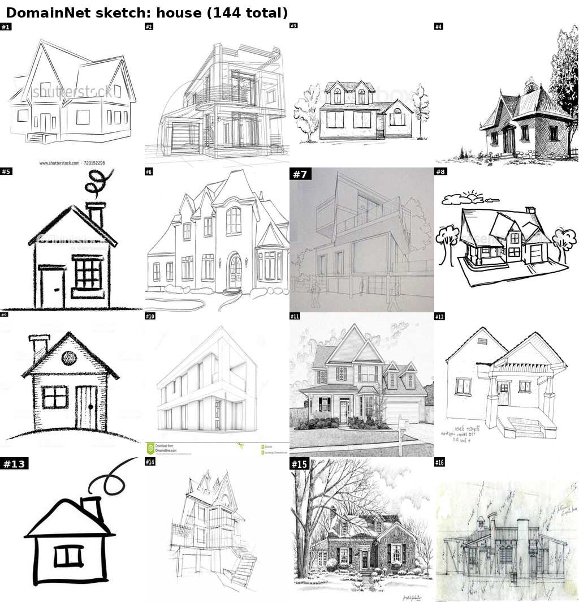

- Архитектурные скетчи с перспективой (#2, #6, #7, #10) - прям нормальные
- Вотермарк Shutterstock на #1 - данные из стоков, ожидаемо
- #13 - мультяшный домик, #5 - клипарт
- В целом хорошие работы с деталями - окна, текстуры, деревья рядом

### Bird
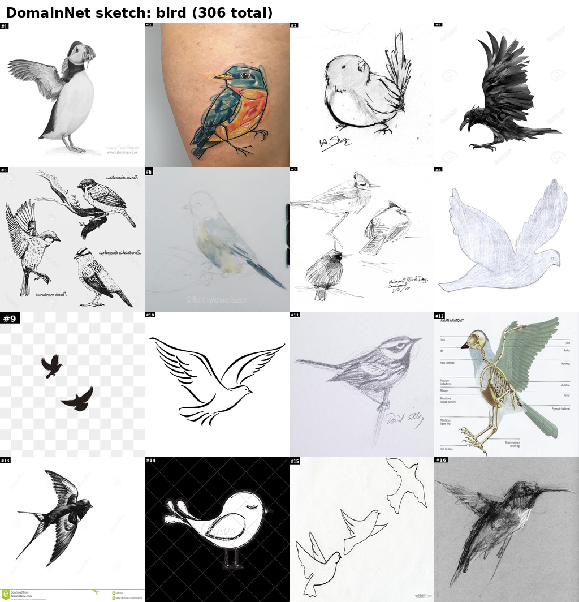

- **Самый грязный класс** тут пожалуй. Татуировка (#2 - цветная!), силуэты (#9), фото колибри (#16)
- Анатомический скелет (#12) - ну это точно не скетч
- Контурные клипарты (#10, #14) вперемешку с карандашными работами (#1, #11)
- Очень много не-скетчей: обработанные фото, цветные иллюстрации, акварель

### Apple
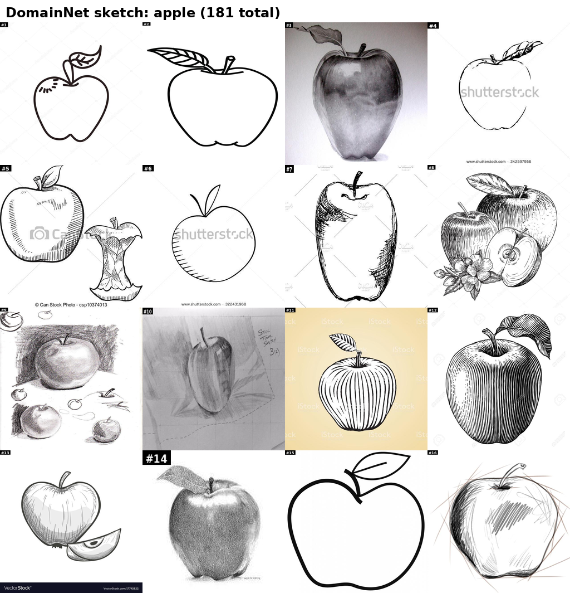

- Штриховые рисунки хорошие (#7, #11, #12, #16)
- Академические этюды (#9 - натюрморт), но #10 - это же **перец**, а не яблоко. Ошибка разметки
- Вотермарков полно (#5 CanStock, #6 Shutterstock, #16 VectorStock)

### Bicycle
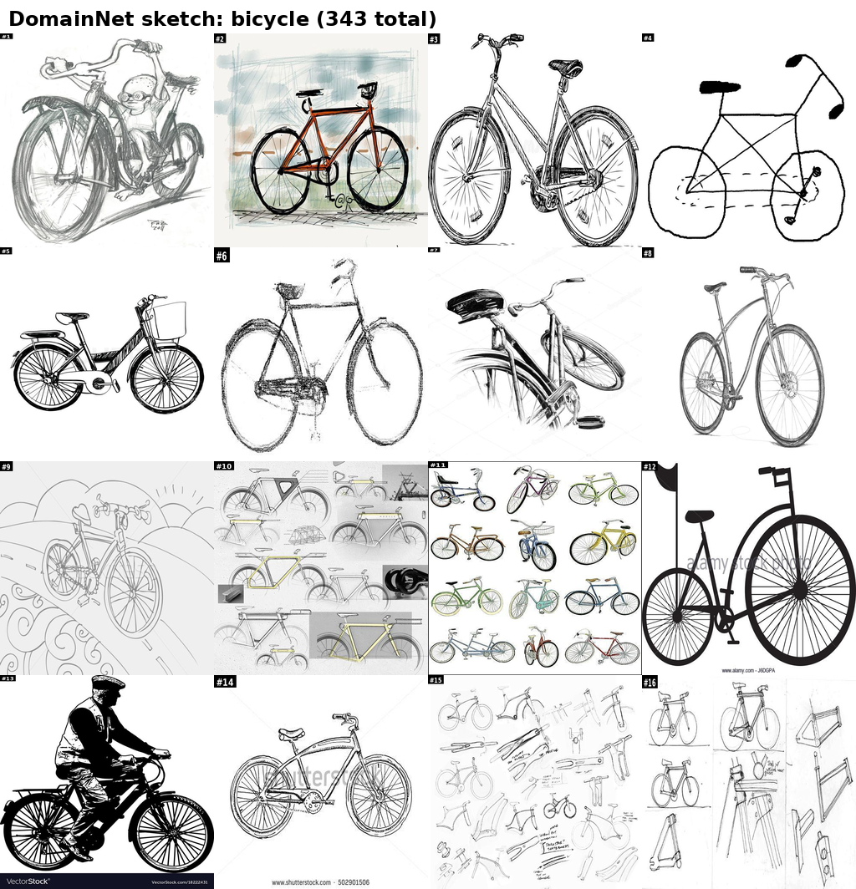

- Тут уже нормальные велосипеды - с правильной геометрией, детализированные
- Винтажные (#1, #3), современные (#6), и даже вроде мотоцикл затесался (#1?)
- #11 - целая таблица разных велосипедов, reference sheet
- Контраст с QuickDraw просто убийственный - там палки с кругами, тут иллюстрации

### Face
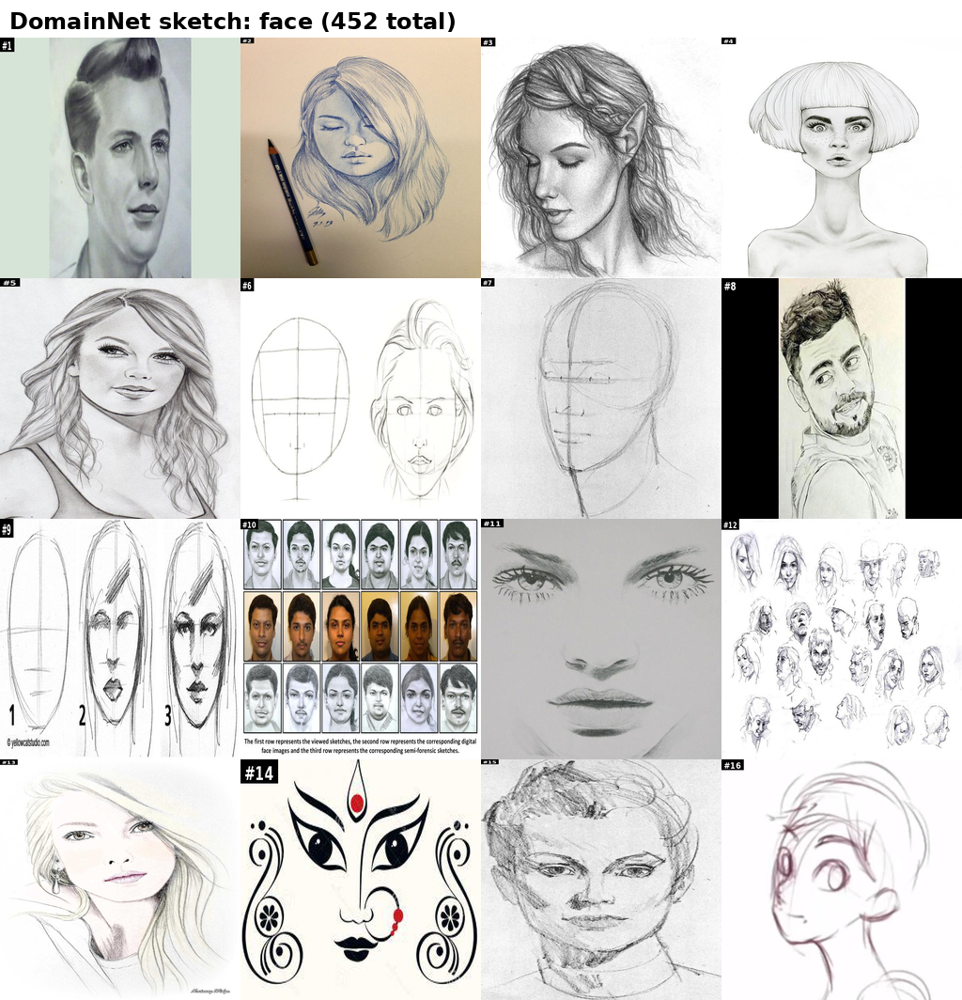

- Портреты крутые: #1, #3, #5 - реалистичные карандашные работы
- Туториал с пропорциями (#6), стилизация (#9 - вытянутые лица)
- #10 - сетка из фоток и скетчей, видимо превью какого-то датасета
- #11 - глаза крупным планом, обрезанное лицо
- Реализм, аниме (#16), Дурга (#14) - стилей вагон

### Tree
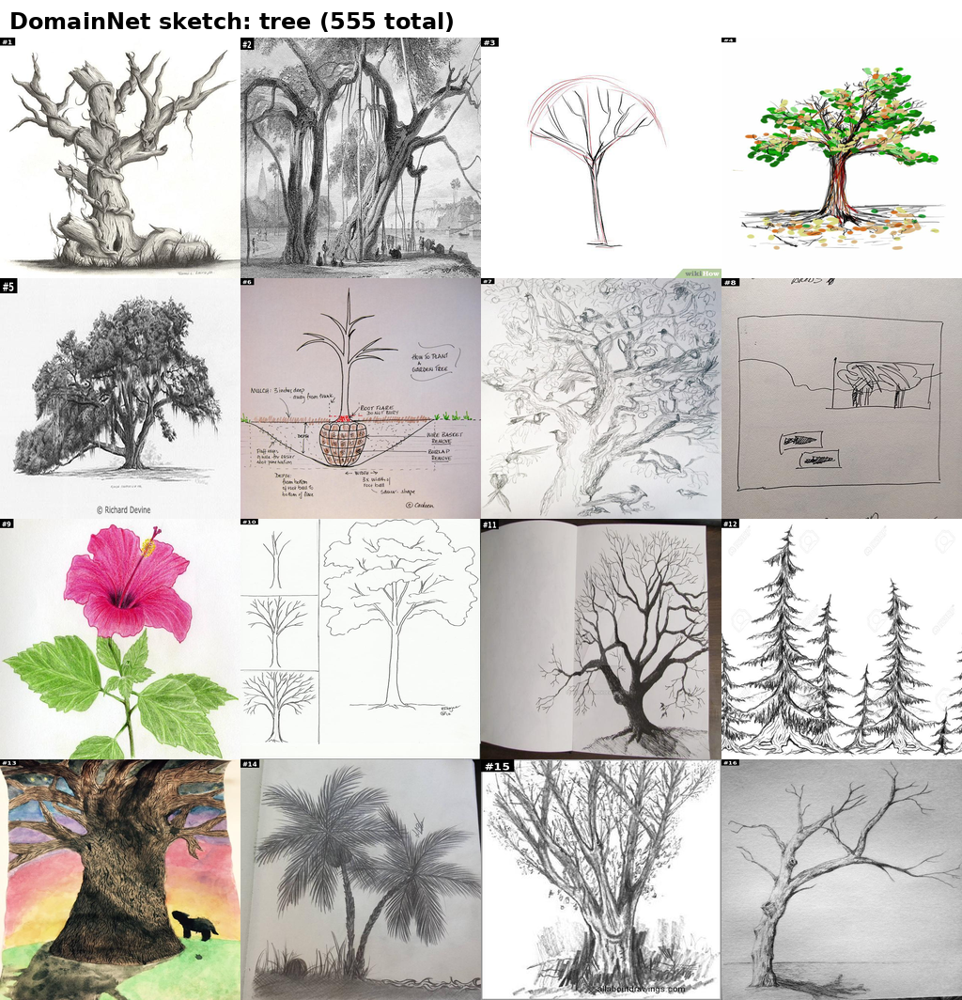

- **Самый шумный класс вообще**. #4 - цветное дерево, #9 - фото гибискуса (цветок! в tree!), #13 - картина с медведем
- Хорошие работы есть (#1, #2, #5, #12), но намешано всего
- #6 - ботаническая диаграмма, #8 - зарисовка из блокнота с подписями от руки
- Короче без фильтрации тут каша

### Fish
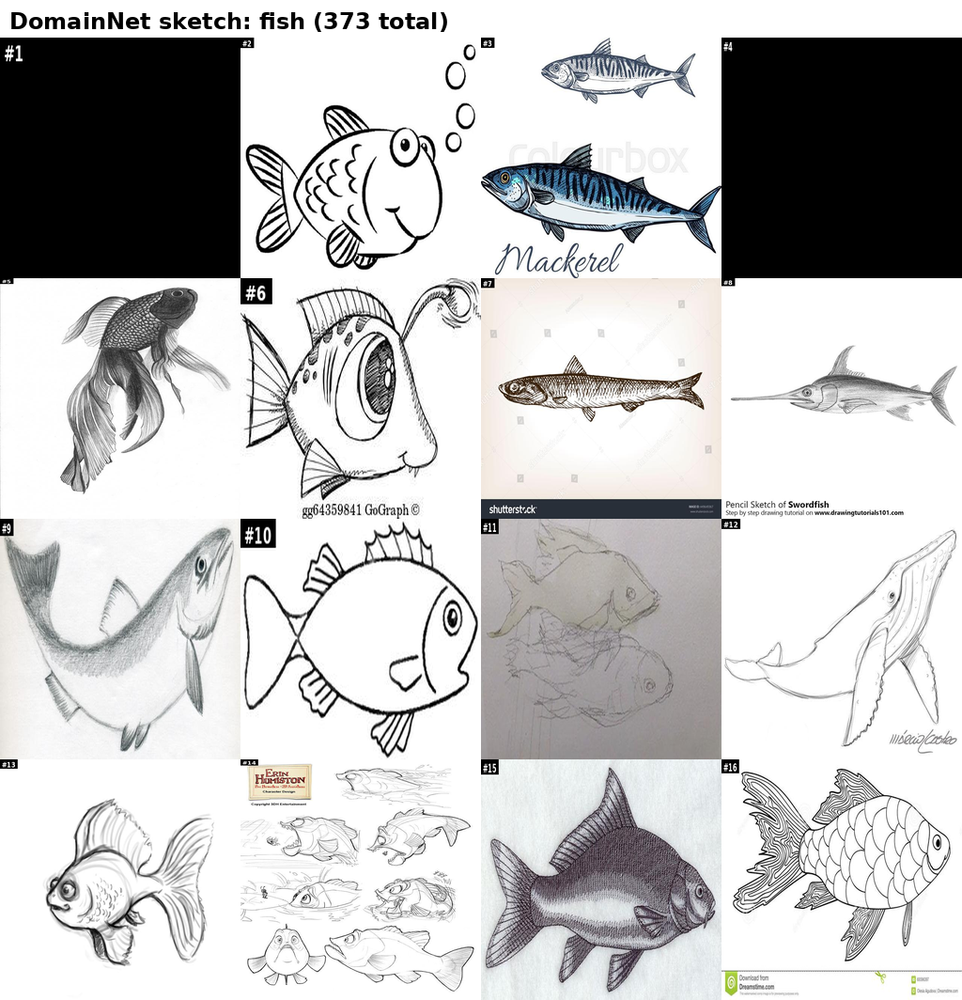

- Нормальное качество: рыбы с чешуёй и плавниками (#5, #9, #14)
- Есть мультяшные (#2, #6, #10) и реалистичные (#3, #7)
- #12 - кит, ну... технически не рыба, но ладно
- Вотермарки и клипарты тоже попадаются

### Итого по DomainNet

**Рейтинг - что пригодно для ControlNet:**

| Ранг | Класс | Оценка | Почему |
|---|---|---|---|
| 1 | car | 9/10 | Дизайнерские скетчи, чистые, красивые |
| 2 | flower | 9/10 | Ботанические иллюстрации, детальные |
| 3 | apple | 8/10 | Качественные штриховые рисунки |
| 4 | bicycle | 8/10 | Детализированные, геометрия правильная |
| 5 | house | 7/10 | Архитектурные скетчи, но есть вотермарки |
| 6 | face | 7/10 | Качество высокое, но стилей слишком много |
| 7 | fish | 7/10 | Нормальное разнообразие, шума мало |
| 8 | cat | 6/10 | Стили гуляют, мусор попадается |
| 9 | bird | 4/10 | Куча не-скетчей - фото, тату, цветные |
| 10 | tree | 4/10 | Гибискусы, картины с медведями - бардак |

**Основные проблемы:**
- **Вотермарки** повсюду (Shutterstock, CanStock, VectorStock) - процентов 15-20 изображений
- **Не-скетчи** затесались: фотографии, цветные иллюстрации, татуировки, 3D рендеры
- **Ошибки разметки**: перец в apple, гибискус в tree - бывает
- **Чёрный фон** на части картинок - инвертированная палитра
- **Стилистический разброс** огромный: от клипартов до фотореализма в одном классе

---

## 4. Сравнение

### Что с чем

| Аспект | QuickDraw | DomainNet |
|---|---|---|
| Детализация | 3-10 штрихов, минимум | От простых до фотореалистичных |
| Консистентность стиля | Высокая (всё одинаково грубое) | Низкая (намешано всего) |
| Шум | ~5-10% (неправильные скетчи) | ~15-25% (фото, вотермарки, ошибки) |
| Как input для ControlNet | Отлично (чистый lineart) | Так себе (нужна фильтрация) |
| Как reference для matching | Плохо (слишком грубые) | Хорошо (если почистить) |
| Размер на класс | 100K+ | 130-555 |

### Что это значит для пайплайна

1. **QuickDraw** - хороший формат входных данных. Пользовательские скетчи будут примерно такого же уровня. BEiT обучен именно на таких рисунках.

2. **DomainNet** - годится как база для DomainNetMatcher, но его надо чистить. Убрать фотки, цветное, чёрный фон, проверить разметку на бред типа перца в яблоках.

3. Между QuickDraw (каракули) и DomainNet (иллюстрации) - пропасть. Собственно эту пропасть пайплайн и должен перекрывать. DomainNet даёт ControlNet понимание структуры объекта, QuickDraw input задаёт позу и композицию.

4. **Нужна автоматическая фильтрация DomainNet** - через SigLIP2 score, проверку на белый фон, может детекцию вотермарков. Руками 3000 картинок не перебрать.

---

## 5. Коллажи

Все коллажи 4x4 (по 16 картинок) лежат в `eda_out/`:

**QuickDraw** (`eda_out/quickdraw/`):
- `qd_01_cat.png` ... `qd_10_fish.png`

**DomainNet** (`eda_out/domainnet/`):
- `dn_01_cat.png` ... `dn_10_fish.png`

Скрипт генерации: `eda_collages.py`
