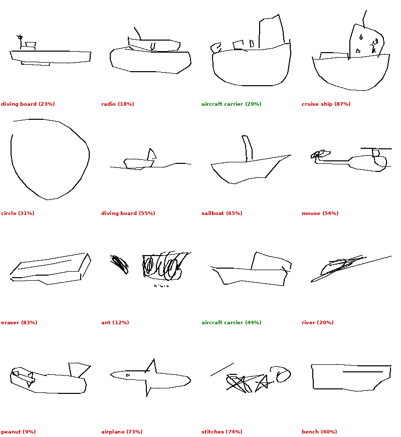
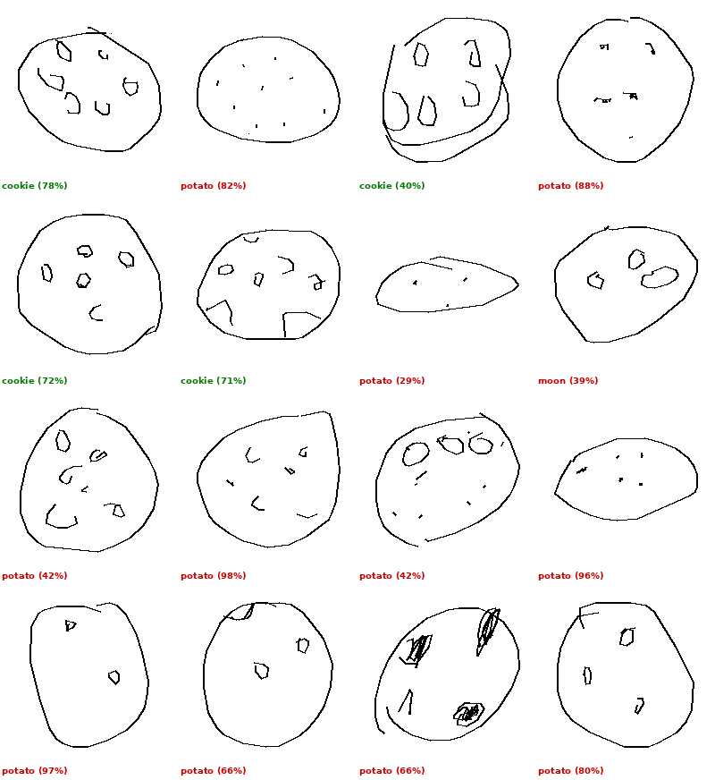
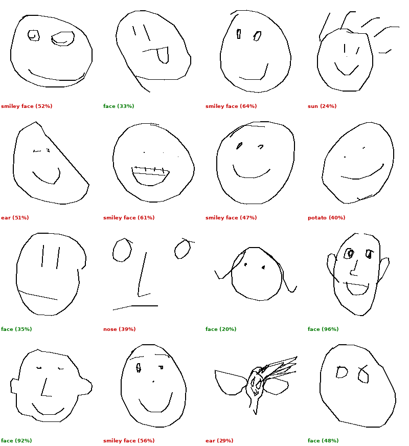
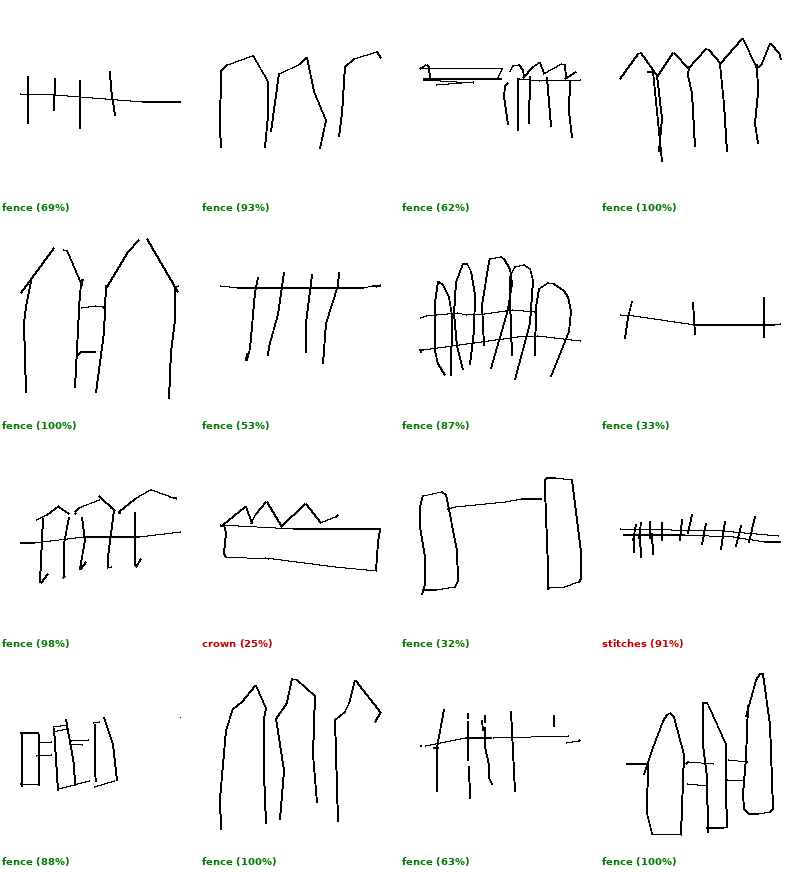

# EDA: Quick Draw скетчи и BEiT классификатор (30 классов)

Дата: 3 мая 2026
Данные: 30 классов x 16 скетчей = 480 сэмплов из Quick Draw

## Зачем этот EDA

BEiT классификатор (`kmewhort/beit-sketch-classifier`) определяет класс скетча с точностью 64.8% на наших 30 классах. Каждая третья ошибка каскадно ломает весь пайплайн генерации. Нужно понять: почему ошибается, на каких классах, есть ли закономерности, можно ли предсказать ошибку.

## Общая картина

- Top-1 accuracy: 64.8% (311/480)
- Top-3 accuracy: 84.8%
- Top-5 accuracy: 89.6%

Top-3 на 20 пунктов лучше top-1. Это значит, что в большинстве случаев правильный класс хотя бы попадает в тройку. Если бы мы генерировали по top-3 и выбирали лучший, accuracy фактически поднялась бы до 85%.


Разброс огромный: от 12% (aircraft carrier) до 100% (hat, butterfly). Можно выделить три группы:

Хорошие (>75%, 12 классов): hat, butterfly, hand, fence, chair, banana, violin, flying saucer, sword, camel, drums, fish, parachute, sea turtle, spider. Общая черта: у этих объектов есть уникальный узнаваемый силуэт, который трудно спутать.

Средние (50-75%, 8 классов): trumpet, backpack, telephone, pliers, bread, steak, swing set, fan. Тут ошибки случаются, но BEiT чаще прав чем нет.

Плохие (<50%, 10 классов): arm, passport, face, broom, asparagus, cookie, aircraft carrier. BEiT чаще ошибается чем угадывает.

## Почему BEiT ошибается: анализ confusion


Топ пар ошибок:

```
cookie -> potato:       11 раз (из 16 скетчей)
broom -> rake:          10 раз
face -> smiley face:     5 раз
arm -> elbow:            4 раза
passport -> power outlet: 4 раза
bread -> hockey puck:    3 раза
spider -> sun:           3 раза
swing set -> table:      3 раза
parachute -> diamond:    3 раза
```

Три типа ошибок:

1. Визуально похожие классы: cookie/potato (оба круглые с пятнами), broom/rake (палка + веер), violin/cello, banana/moon, parachute/diamond. BEiT путает, потому что скетчи реально похожи. Человек бы тоже засомневался.

2. Семантические соседи: face/smiley face (круг + глаза + рот), arm/elbow (часть руки), trumpet/trombone (духовые). Тут BEiT видит правильную категорию, но выбирает не тот класс внутри нее.

3. Полный бред: passport/power outlet, spider/sun, aircraft carrier/diving board. Ошибки без логики, BEiT просто не понимает скетч.

Тип 1 для пайплайна не критичен: если мы нарисовали cookie, а BEiT сказал potato, DomainNet найдет линарт картошки, который формой похож на cookie. ControlNet сгенерирует что-то круглое и аппетитное. Вот почему cookie набирает +3.92 SigLIP2 при 25% accuracy.

Тип 3 ломает пайплайн полностью. Passport/power outlet ни формой, ни семантикой не связаны. Результат будет мусором.

## Уверенность BEiT: ошибается уверенно или нет?


Средняя уверенность:
- Правильные ответы: 0.80 (медиана 0.91)
- Ошибки: 0.50 (медиана 0.45)

Хорошая новость: ошибки в среднем менее уверенные. Можно использовать порог уверенности как сигнал.

Плохая новость: 77 из 480 сэмплов (16%) это уверенные ошибки (confidence > 50%). BEiT уверен что это potato, хотя это cookie. Порог уверенности поймает часть ошибок, но не все.


Топ уверенных ошибок: cookie->potato (98%), cookie->potato (97%), cookie->potato (96%), trumpet->eyeglasses (96%), arm->elbow (96%), fan->ceiling fan (94%), passport->power outlet (93%). Модель абсолютно уверена и абсолютно неправа.

## Сложность скетчей: влияет ли на accuracy?


Среднее количество штрихов: от 2 (hand, arm, bread) до 10 (spider).

Корреляции:
- Штрихи vs accuracy: r = -0.37
- Точки vs accuracy: r = -0.34
- Покрытие bbox vs accuracy: r = 0.00

Слабая отрицательная корреляция со штрихами. Более сложные скетчи (больше штрихов) чуть чаще ошибаются. Но связь слабая, объясняет процентов 14 variance.

Покрытие (какую долю canvas занимает скетч) вообще не коррелирует. Размер скетча не влияет.

Вывод: сложность скетча это не главный фактор ошибок BEiT. Главное это межклассовая похожесть (cookie/potato, broom/rake).

## Детальный разбор по классам

### aircraft carrier (12% accuracy)



Катастрофа. 14 из 16 скетчей определены неправильно. Проблема очевидна: скетч авианосца это прямоугольник на воде. BEiT видит diving board, radio, cruise ship, sailboat, eraser, airplane, stitches, bench. Каждый раз что-то новое, нет доминирующей confusion. Класс настолько визуально неспецифичен, что BEiT не знает куда его отнести. При этом top-5 accuracy 62%, то есть правильный ответ часто в пятерке.

### cookie (25% accuracy)



11 из 12 ошибок: potato. Круглая форма с неровностями внутри. BEiT обучен на ImageNet, где cookie и potato визуально отличаются (фото). Но в скетчах это одно и то же: овал с точками/пятнами. Top-3 accuracy 75%, то есть cookie почти всегда во второй-третьей позиции.

Парадокс: несмотря на 25% accuracy, этот класс дает лучший SigLIP2 score (+3.92) во всем eval. Потому что potato и cookie визуально близки, и ControlNet генерирует что-то круглое и аппетитное в обоих случаях.

### face (38% accuracy)



5 из 10 ошибок: smiley face. Остальные: ear (2), sun, nose, potato. Проблема: скетч лица это круг + два глаза + рот. Это буквально смайлик. BEiT не может различить "лицо" от "смайлика", потому что в Quick Draw это одинаковые картинки.

Есть один скетч (14-й) где кто-то нарисовал волну вместо лица. BEiT говорит ear (29%). Тут скорее проблема с качеством данных Quick Draw.

### fence (88% accuracy)



Хороший accuracy, но визуально скетчи очень разные: штакетник, сетка-рабица, частокол, решетка. BEiT справляется, потому что общий паттерн (вертикальные линии + горизонталь) уникален. Две ошибки: crown (25%) и stitches (91%). Забор с зубцами правда похож на корону.

## Что из этого следует

1. Top-3 reranking через SigLIP2 поднял бы accuracy с 65% до 85%. Это самый перспективный путь: генерировать по трем классам, выбирать лучший. Цена: 3x время генерации.

2. Порог уверенности (confidence < 40%) отфильтрует часть ошибок, но 16% ошибок уверенные. Нельзя полагаться только на порог.

3. Визуальная похожесть классов это главная причина ошибок, а не сложность скетча. cookie/potato, broom/rake, face/smiley face, banana/moon. Это не баг BEiT, это свойство Quick Draw: скетчи визуально похожих вещей выглядят одинаково.

4. Не все ошибки одинаково вредны. cookie->potato безвреден для пайплайна (генерация все равно хорошая). aircraft carrier->diving board разрушителен. Нужна мера "стоимости ошибки": насколько далеки визуально два класса.

5. SigLIP2 zero-shot не работает как замена BEiT (25.4% accuracy, тестировали отдельно). Модель обучена на фотографиях, а не на скетчах. Видит "squiggle", "boomerang", "paper clip" вместо реальных классов.

6. Fine-tuning остается самым надежным путем: у Quick Draw 50 миллионов скетчей, а BEiT обучен только на ImageNet + Quick Draw с неизвестным рецептом. ViT, обученный прицельно на Quick Draw с правильной аугментацией, должен дать 85-90%.

## Файлы

```
eda_30c_out/
  eda_data.json              - сырые данные (480 сэмплов, BEiT predictions, stroke stats)
  accuracy_bars.png          - accuracy по классам (столбчатая диаграмма)
  confidence_histogram.png   - распределение уверенности (correct vs wrong)
  confusion_examples.png     - визуальные примеры top confusion пар
  complexity_grid.png        - примеры скетчей отсортированные по кол-ву штрихов
  worst_confident_errors.png - 16 самых уверенных ошибок
  class_*.png                - 4x4 коллажи для каждого из 30 классов
```
