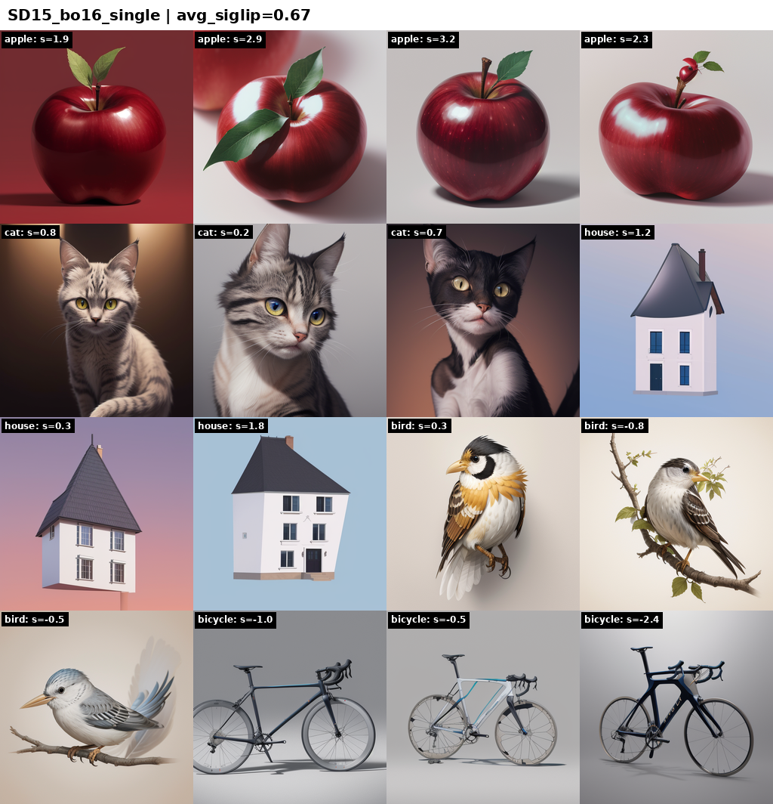

# Интеллектуальный ассистент для художников: превращение набросков в реалистичные изображения с помощью ControlNet и текстовых подсказок

## Структура проекта

### Скрипты (корень)
| Файл | Назначение |
|------|-----------|
| `run_experiments.py` | Основной эксперимент: 6 стадий пайплайна (baseline → DomainNet → filtered → best-of-4 SigLIP/Kimi → BG removal) на SD1.5 и SDXL |
| `run_bestof_study.py` | Best-of-N исследование: сравнение best-of-1/4/8 с single SigLIP2 отбором на обеих моделях |
| `run_bestof_multi.py` | Multi-criteria SigLIP2: сравнение single-prompt vs 7-осевого селектора (artifacts, anatomy, sharpness и тд) |
| `run_bo16.py` | Дополнительный прогон best-of-16 на SD1.5, single vs multi |
| `eda_collages.py` | EDA: визуализация датасетов, сетки примеров |
| `eda_filter_domainnet.py` | Фильтрация DomainNet по SigLIP2, анализ распределения скоров |

### Пайплайн (`quick_draw/`)
| Файл | Назначение |
|------|-----------|
| `v8_tailored.py` | Полный пайплайн SD1.5 + BEiT классификатор + SigLIP2 скоринг + Kimi |
| `v9_sdxl.py` | Полный пайплайн SDXL |
| `v1-v7_*.py` | Ранние итерации пайплайна (хронология экспериментов) |
| `prompts.json` | Промпты и негативы для 345 классов QuickDraw |
| `debug_siglip.py` | Тесты SigLIP2 скоринга, чувствительность к промптам |
| `debug_kimi.py` | Тесты Kimi K2.5 API (pick_best, expert_score) |
| `demo_beit*.py` | Демки BEiT классификатора скетчей |
| `demo_pipeline_*.py` | End-to-end демонстрации пайплайна |

### Веб-интерфейс (`webapp/`)
| Файл | Назначение |
|------|-----------|
| `backend.py` | FastAPI сервер: рисование скетча → генерация изображения |

### Отчёты и данные
| Файл/папка | Назначение |
|------------|-----------|
| `BestOfStudy.md` | Полный отчёт: эволюция пайплайна + best-of-N + multi-criteria SigLIP2 |
| `experiments.md` | Лог всех экспериментов с метриками (хронологический) |
| `EDA.md` | Exploratory data analysis по датасетам |
| `FILTERING.md` | Анализ фильтрации DomainNet |
| `experiments_report/` | Гриды и JSON от run_experiments |
| `bestof_study/` | Гриды и JSON от best-of-N study |
| `bestof_multi/` | Гриды и JSON от multi-criteria study |
| `bestof_bo16/` | Гриды и JSON от best-of-16 |

## Current Pipeline

Crude sketch → lineart → ControlNet + Dreamshaper 8 → Refiner → Best-of-N selection by SigLIP2 scoring.

Номер темы 90
Уровень темы pro 

Команда: 
@TOPAPEC (Данил Бугриенко)
Руководитель: 
@jdbelg (Глеб Булыгин)

## Общий план проекта 
Грубыми мазками делаем 2 LORA адаптера:
1. Из грубого скетча в детальный скетч
2. Из детального скетча в фильнальное изображение

### Детали первой стадии
Есть большие вопросы как тренировать image to image диффузию, учитывая, что мы тренируем скорее всего Stable Diffusion XL.
IP адаптер мы натренировать вряд ли сможем, поэтому пока есть вариант обычной текст в скетч лоры и далее в первые шаги гайдим контролнетом и последние шаги отдаем на откуп модели, либо 
модель, которая через clip или другой энкодер по картинке предсказывает промпт и далее по промпту генерируем через нашу лору готовый скетч.

### Детали второй стадии
Тут более понятная задача - по детальному скетчу мы гайдим почти до самого конца модель через контролнет и в конце даем ей потворить несколько шагов.

### Детали датасета
Первый датасет, который собираем - 2д арт с одним объектом в кадре (+ теги). Источники для начала - danbooru (будет bias в аниме стиль).
Скорее всего будет общий большой датасет и датасет с отобранными и самыми приятными стилями.
Автоматический отбор качественных изображений будем делать по перцентилю PickScore. 

### Аугментации
На картинках центрируем объект и снимаем lineart скетч. Храним и оригинал и скетч.
Далее скетч искажаем и упрощаем алгоритмически там, чтобы он больше был похож на человеческий скетч. 
Возможно попробуем упрощать скетчи через преждевременное завершение генерации через контролнет (15 шагов вместо 30 по скетчу и далее снова выделение скетча). 

### Финальный интерфейс
Пока целевой интерфейс - сайт. На вход от пользователя скетч без текстовых подсказок (рисуется прямо пальцем или мышкой на сайте), на выход - готовая картинка. 

## План 
1. Созвонились-познакомились
2. Собираем датасет пар скетчей и картинок с тегами. Смотрим на среднее качество данных без ручного отбора. Пробуем набрать эталонных стилей для формирования уникального стиля модели. Пробуем методы упрощения детального скетча.
3. Первая лора из грубого скетча в детальный на наших датасетах и возможная корректировка подхода.
4. Дальше будем смотреть на результаты третьего шага, так как он самый неопределенный в проекте и будем корректировать план
5. Продолжение следует
6. Продолжение следует
7. Продолжение следует

# Итоги контрольной точки 2
Попробовал разные алгоритмы скетчей (как будто промерно все из общепринятого и свой костыль "перемножить изображение само на себя несколько раз со случайным сдигом на несколько пикселей в радиусе" - чтобы увеличить толщину линий)
В основном я концентрировался на способности диффузиции захватить концепт того, что есть на скетче и улучшить а) скетч без промпта б) нарисовать красивую картинку по примерному скетчу из контролнета тоже без промпта
Такой способности нет или ее крайне недостаточно - то есть без явного промптинга как-то отрефайнить скетч не получится ни sdxl, ни sd1.5 - с промптами общего содержания "делай красиво не делай некрасиво" все в итоге сходится к равномерному или не очень шуму. 
Поэтому если мы хотим из скетча пользователя получать какую-то картинку лучше этого скетча - в любом случае придется распознавать. 

На что sdxl способна без промпта только на скетче

на что способна sd 1.5 без промпта на скетче

Примеры предельно понятные - нейронка явно о чем-то догадалась, но я просто не смог сделать какое-то вменяемое качество как улучшенного скетча (он просто получался либо +- один в один с исходником, либо случался мусор), так и получения норм изображение из эскиза (без явного промпта, упоминающего это изображение) - какие-то намеки на понимание есть, но этого недостаточно. Конечно можно брать скетч, генерить без промптинга картинку, дальше распознавать и теггировать, но вероятность успеха низкая.

Тогда следующий этап такой - берем формат скетча из quickdraw.withgoogle.com из используем как бейслайн обученные на этом датасете классификаторы (Doodlenet) и дальше скорее всего глупенькой ллмкой с подробным промптом буду разворачивать в норм описание объекта.
и по объект  специфичному промпту уже будем дальше все делать. 
Только осталось понять, как придумывать разные детали типа освещения, поз, стилей. Стили могут быть из пресетов, остальное мб надо из скетча доставать. 
