# Sketch Bomb: исследование пайплайна sketch-to-image

Дата: 3 мая 2026

## Задача

Из рукописного скетча Quick Draw сгенерировать фотореалистичную картинку. Пайплайн: скетч -> BEiT классификатор (что нарисовано?) -> DomainNet matching (найти похожий линарт) -> ControlNet генерация (из линарта в картинку) -> SigLIP2 отбор лучшего из 4 кандидатов.

Вопросы, на которые отвечает этот отчет: какая модель генерации лучше, насколько хорошо работает пайплайн на 30 классах, где главные проблемы.


## Эксперимент 1: выбор модели генерации

Сравнение трех моделей на 10 классах x 8 сэмплов = 80 скетчей, 4 кандидата на скетч:

- SD 1.5, 20 шагов Euler, 512px, с img2img refiner
- SDXL, 20 шагов Euler, 1024px, с img2img refiner
- SDXL-Lightning, 4 шага Euler trailing, 1024px, без refiner (дистиллированная модель ByteDance)

| Модель | Скорость | SigLIP2 (best-of-4) | SigLIP2 (без отбора) |
|--------|----------|---------------------|----------------------|
| SD 1.5 | 1.81 с | +1.438 | -0.391 |
| SDXL | 13.79 с | +1.192 | -0.592 |
| Lightning | 2.05 с | +1.870 | +0.207 |

Lightning быстрее SDXL в 6.7 раз и качественнее на 30%. По скорости почти догоняет SD 1.5 (2.05 vs 1.81), но по качеству обгоняет на 30%. SDXL проигрывает по обоим показателям: медленный и не лучший.

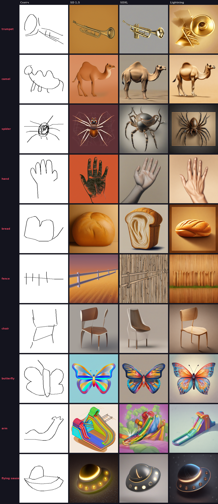

Стилистическая разница видна на сетке. SD 1.5 тяготеет к плоским иллюстрациям: чистые контуры, яркие цвета, клипарт. Lightning дает фотореалистичные текстуры: шерсть у верблюда, блики на трубе, корочка хлеба. SDXL где-то посередине, иногда выглядит "пластиковым".

Несколько характерных примеров:

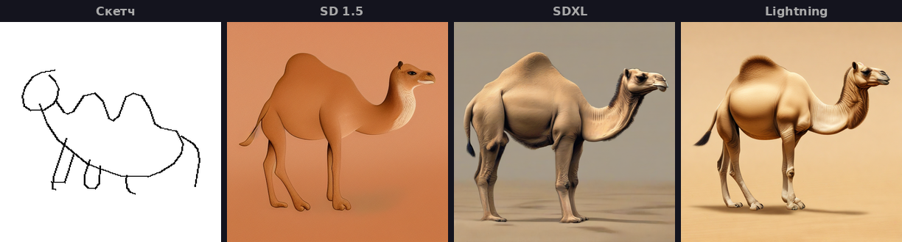

Верблюд. SD 1.5 мультяшный, из детской книжки. Lightning фотореалистичный: видна шерсть, живая поза. Один из лучших результатов в eval.

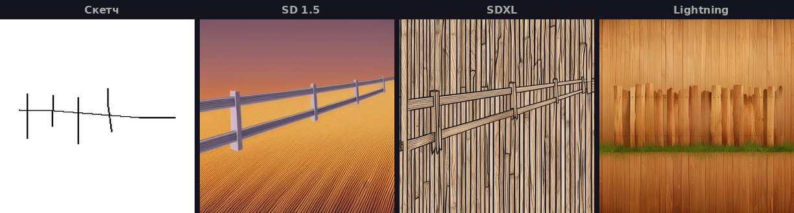

Забор. Единственный класс, где SD 1.5 лучше. SD 1.5 нарисовал забор на фоне заката, с перспективой. Lightning и SDXL залипли в текстуры: крупный план досок без контекста. Для повторяющихся структур SDXL/Lightning генерируют фрагменты вместо сцен.

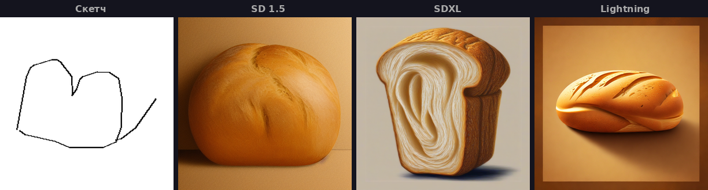

Хлеб. SDXL провалился: внутренность хлеба похожа на ухо. SD 1.5 нормальная булочка. Lightning идеальный батон с надрезами.

Итого: Lightning побеждает на 8 из 10 классов. SD 1.5 лучше только на структурных объектах (забор, стул) где нужна композиция. Для следующих экспериментов берем Lightning.


## Эксперимент 2: масштабный eval на 30 классах

480 скетчей, 1920 генераций (4 кандидата на скетч). Только Lightning.

| Метрика | Значение |
|---------|----------|
| SigLIP2 (best-of-4) | +2.18 +/- 1.67 |
| SigLIP2 (без отбора) | +0.50 |
| BEiT accuracy | 64.8% |
| Скорость генерации | 2.03 с/картинку |

SigLIP2 score: насколько картинка соответствует промпту "a high quality illustration of a {label}". Положительный = лучше среднего.

Распределение: 92% картинок выше нуля, 80% выше +1, 32% выше +3. Только 8% уходят в минус. В целом пайплайн работает.

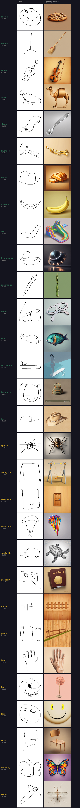

Классы отсортированы по скору: лучшие сверху, худшие снизу. Верхняя половина (cookie, broom, violin, camel) содержит детальные реалистичные картинки. Нижняя (face, chair, butterfly, sword) деградирует: где-то BEiT промахнулся и сгенерировалось не то, где-то класс сам по себе сложный для генерации.


## Лучшие и худшие классы

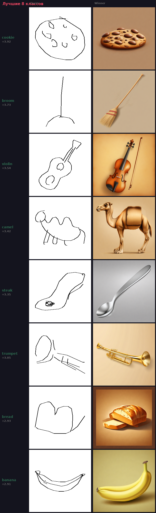

cookie (+3.92), broom (+3.73), violin (+3.54), camel (+3.42), steak (+3.35), trumpet (+3.05), bread (+2.93), banana (+2.91).

Все это объекты с характерным силуэтом: скрипку не спутаешь с чайником, верблюда с автобусом. У Lightning хорошо получаются живые существа (camel, sea turtle), еда (cookie, steak, bread, banana), музыкальные инструменты (violin, trumpet).

Парадокс cookie: BEiT accuracy всего 25% (4 из 16 определены правильно). 11 из 12 ошибок это "potato". Но скетч cookie и potato выглядят одинаково (овал с точками), поэтому DomainNet находит похожий линарт и ControlNet генерирует что-то круглое и аппетитное. Класс-сосед спасает ситуацию.

Та же история с broom (31% accuracy, 10 из 11 ошибок "rake"). Грабли и метла визуально близки: палка + веер. Ошибка BEiT безвредна.

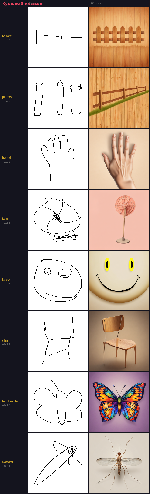

fence (+1.36), pliers (+1.29), hand (+1.28), fan (+1.18), face (+1.08), chair (+0.97), butterfly (+0.94), sword (+0.84).

Тут два типа проблем:

Первый: BEiT ошибается и генерируется не то. face -> smiley face (лицо = смайлик для BEiT), pliers -> fence/Eiffel Tower (плоскогубцы приняты за забор), sword -> mosquito (меч превращается в насекомое). На картинке видно: эмодзи вместо лица, стрекоза вместо меча.

Второй: BEiT правильный, но класс сложный для генерации. butterfly имеет 100% BEiT accuracy, но SigLIP2 всего +0.94. hand имеет 94% accuracy, но руки это known hard problem для диффузионных моделей. fence 88% accuracy, но забор это текстура, не объект, и модель генерирует фрагмент. fan 50% accuracy, и даже когда BEiT прав (как на картинке), результат посредственный.

Полная таблица:

```
Класс                 best-of-4   без отбора   gain      BEiT
---------------------------------------------------------------
cookie                +3.92       +2.47        +1.45     25%
broom                 +3.73       +1.35        +2.39     31%
violin                +3.54       +2.32        +1.22     81%
camel                 +3.42       +2.04        +1.38     75%
steak                 +3.35       +1.10        +2.25     56%
trumpet               +3.05       +1.12        +1.92     69%
bread                 +2.93       +0.60        +2.33     62%
banana                +2.91       +2.19        +0.72     88%
arm                   +2.83       +0.75        +2.08     44%
flying saucer         +2.82       +0.51        +2.30     81%
asparagus             +2.55       +0.96        +1.59     25%
drums                 +2.44       +0.88        +1.56     75%
fish                  +2.21       +0.77        +1.44     75%
aircraft carrier      +2.19       -0.02        +2.20     12%
backpack              +2.17       +0.94        +1.23     62%
hat                   +2.13       +0.84        +1.29     100%
spider                +1.86       +0.41        +1.45     69%
swing set             +1.75       +0.03        +1.71     56%
telephone             +1.75       +0.21        +1.54     62%
parachute             +1.63       -0.25        +1.88     75%
sea turtle            +1.60       +0.12        +1.48     75%
passport              +1.54       -0.54        +2.08     44%
fence                 +1.36       -1.44        +2.80     88%
pliers                +1.29       -0.68        +1.98     62%
hand                  +1.28       +0.69        +0.59     94%
fan                   +1.18       -0.83        +2.01     50%
face                  +1.08       -0.17        +1.25     38%
chair                 +0.97       -0.83        +1.80     88%
butterfly             +0.94       +0.19        +0.75     100%
sword                 +0.84       -0.71        +1.55     81%
```


## BEiT: главная проблема пайплайна

BEiT определяет класс скетча из 345 классов Quick Draw. Accuracy на 30 тестовых классах: 64.8%. Каждый третий скетч классифицируется неправильно, и ошибка каскадно ломает весь пайплайн.

При масштабировании с 10 до 30 классов accuracy упала с 77.5% до 64.8%. Больше классов = больше confusion.

Top-3 accuracy: 84.8%. Правильный класс почти всегда в тройке. Top-5: 89.6%.

### Какие классы проблемные

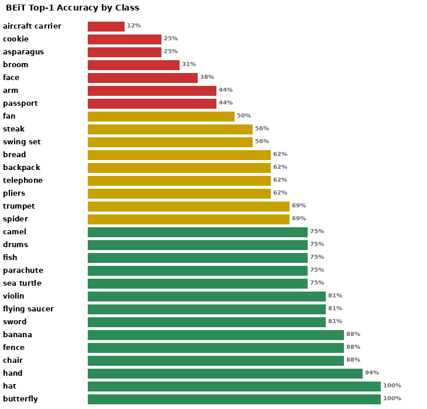

Пять худших:

- aircraft carrier (12%): 14 из 16 неправильные. Скетч авианосца это прямоугольник с палочкой. BEiT видит diving board, radio, cruise ship, eraser, airplane. Каждый раз что-то новое.
- cookie (25%): 11 из 12 ошибок = potato. Безвредная ошибка, визуально cookie и potato одинаковые.
- asparagus (25%): палка спаржи похожа на matches, pencil, crayon, fork.
- broom (31%): 10 из 11 ошибок = rake. Тоже безвредная.
- face (38%): 5 из 10 ошибок = smiley face. Скетч лица это буквально смайлик.

Пять лучших: hat (100%), butterfly (100%), hand (94%), fence/banana/chair (88%).

### Типы ошибок

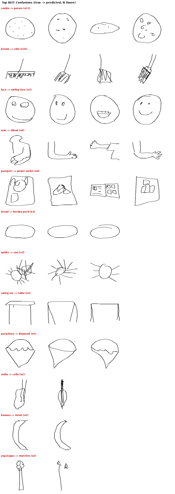

Три типа:

Визуально похожие классы: cookie/potato, broom/rake, violin/cello, banana/moon, parachute/diamond. Скетчи реально одинаковые. Человек бы тоже засомневался. Для пайплайна такие ошибки часто безвредны, потому что классы-соседи визуально близки.

Семантические соседи: face/smiley face, arm/elbow, trumpet/trombone. BEiT видит правильную категорию, но не тот конкретный класс. Тоже не фатально.

Полный бред: passport/power outlet, spider/sun, aircraft carrier/diving board. Эти ошибки ломают пайплайн.

### Уверенность ошибок

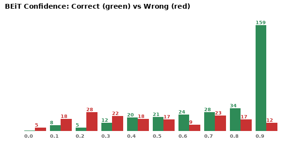

Правильные ответы: средняя уверенность 0.80 (медиана 0.91). Ошибки: 0.50 (медиана 0.45). BEiT менее уверен когда ошибается, но 77 из 480 сэмплов (16%) это уверенные ошибки с confidence > 50%. Порог уверенности поймает часть проблем, но не все.

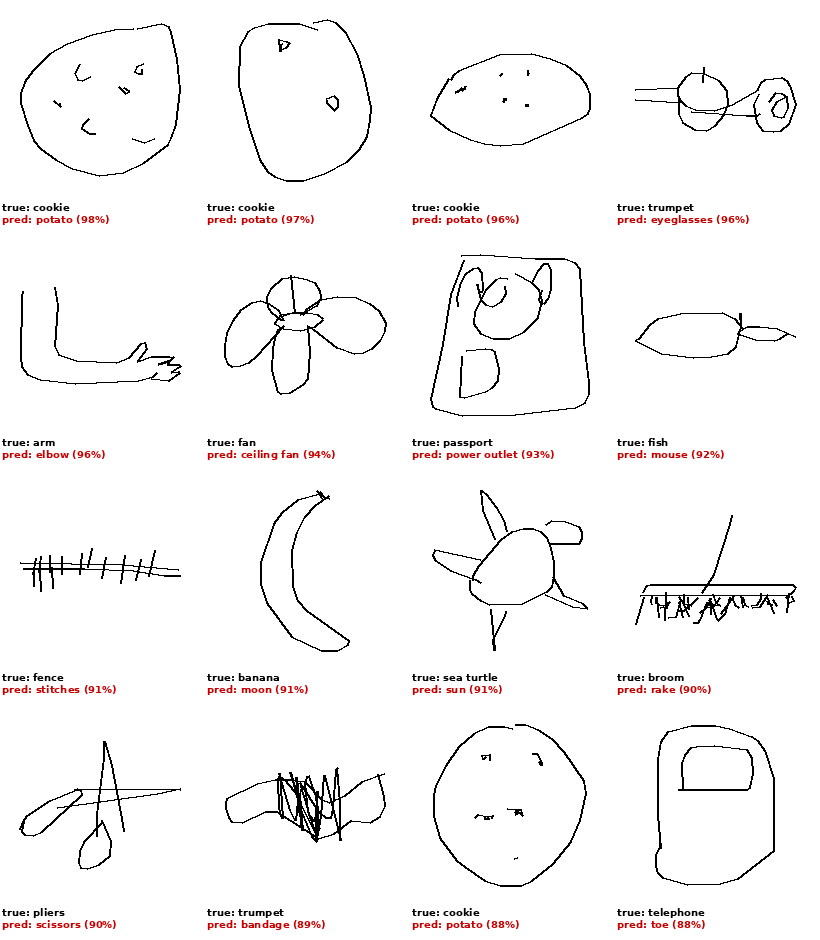

Примеры: cookie -> potato (98%), trumpet -> eyeglasses (96%), arm -> elbow (96%). Модель абсолютно уверена и абсолютно неправа.

### Accuracy BEiT не коррелирует с качеством генерации

Корреляция BEiT accuracy и SigLIP2 score: r = -0.30. Почти шум.

cookie: BEiT 25%, SigLIP2 +3.92 (лучший класс). butterfly: BEiT 100%, SigLIP2 +0.94 (второй с конца).

Причина: SigLIP2 скорит по label от BEiT. Если BEiT сказал "potato" и мы сгенерировали хорошую картошку, SigLIP2 ставит высокий балл. Метрика говорит "отлично", пользователь видит картошку вместо печенья.

SigLIP2 score не отражает user experience. Для честной оценки нужно скорить по ground truth классу, а не по предсказанному. В eval ground truth есть (мы знаем что рисовалось), в продакшене нет.

### Сложность скетча не объясняет ошибки

Среднее количество штрихов: от 2 (hand, arm, bread) до 10 (spider). Корреляция штрихов с accuracy: r = -0.37. Слабая. Покрытие bbox: r = 0.00.

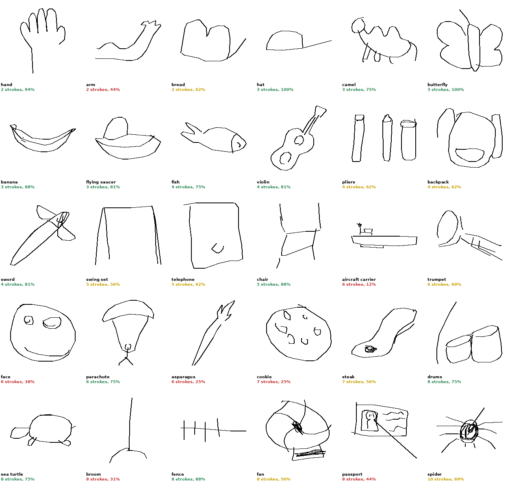

hand (2 штриха, 94% accuracy) и arm (2 штриха, 44% accuracy) одинаково просты, но результат разный. spider (10 штрихов) классифицируется лучше чем cookie (7 штрихов). Главный фактор не сложность, а межклассовая похожесть.

### SigLIP2 zero-shot не работает как замена

Протестировали SigLIP2 zero-shot (encode sketch + 345 text prompts, pick argmax) как замену BEiT. Результат: 25.4% accuracy. Хуже BEiT в 2.5 раза.

Пробовали 7 шаблонов промптов: "a sketch of a {}", "a line drawing of a {}", "a {} doodle". Лучший дал 45% на 5 классах. SigLIP2 обучен на фотографиях, не на скетчах. Видит "squiggle", "boomerang", "paper clip" вместо реальных классов.

BEiT (kmewhort/beit-sketch-classifier) fine-tuned на Quick Draw и знает специфику. Zero-shot модели общего назначения этого не умеют.


## Best-of-4: зачем отбор критичен

Для каждого скетча генерируется 4 кандидата. SigLIP2 скорит каждого и выбирает лучшего. Средний gain от отбора: +1.67.

Без отбора средний SigLIP2 = +0.50. С отбором = +2.18. Разница в 4 раза.

Gain неравномерный:

- Минимальный: hand +0.59, banana +0.72, butterfly +0.75. Все 4 кандидата похожие, выбирать особо не из чего.
- Максимальный: fence +2.80, broom +2.39, bread +2.33. Огромный разброс качества, отбор вытаскивает лучший.

Закономерность: чем нестабильнее класс, тем больше помогает отбор.

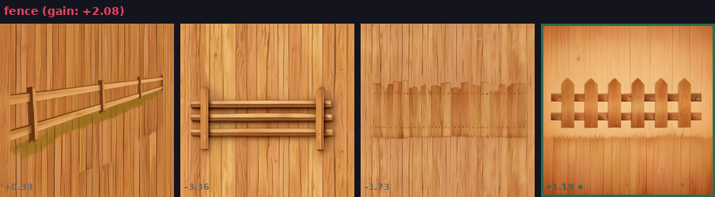

Четыре кандидата для одного скетча забора. Все разные. Разница между лучшим и худшим может быть 4+ пункта SigLIP2. Без отбора пользователь получил бы случайного.

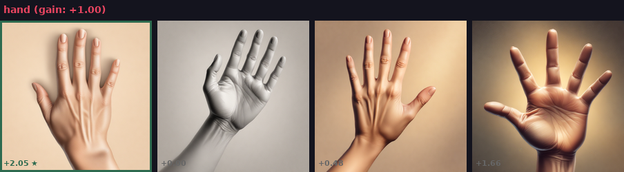

Четыре кандидата для руки. Все похожи, все нормальные. Отбор дает мало.

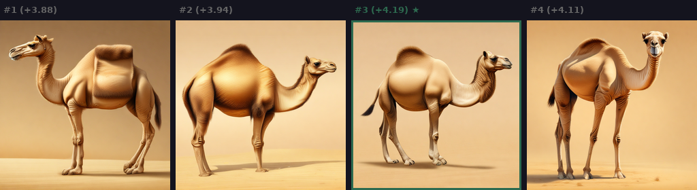

Верблюд: все 4 от +3.87 до +4.19. Модель стабильна, каждый кандидат хорош.

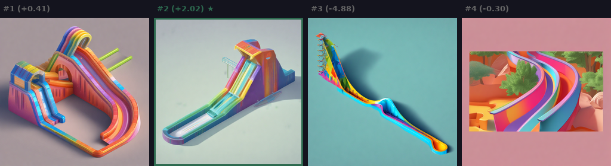

Рука (BEiT accuracy 44%): на этом сэмпле BEiT вообще промахнулся мимо класса, и пайплайн сгенерировал 4 водных горки. Скоры от -4.88 до +2.02. Это наглядная иллюстрация каскадной ошибки: неправильная классификация ломает всю цепочку, и best-of-4 отбирает лучшую горку вместо лучшей руки.

Почему не best-of-8 или best-of-16: 4 кандидата = 8 секунд (2 с/картинку). Best-of-8 удвоит время до 16 секунд. Для webapp это слишком долго.


## Технические оптимизации

### BiRefNet вместо rembg

Удаление фона для DomainNet matching: rembg u2net (CPU) 14.62 с, BiRefNet (GPU, fp16) 0.22 с. 33x ускорение. Качество масок сопоставимое. До замены rembg занимал 70% времени пайплайна.

### ControlNet ablation

controlnet_conditioning_scale=0.7 оптимум (тестировали 0.3-1.0). control_guidance_end=1.0 лучше 0.8. Refiner для Lightning слегка вредит, отключен.

### Scheduler

Euler 20 шагов лучше всех для ControlNet. EulerAncestral и DPM++ дают артефакты (ControlNet обучался на Euler). 30 шагов хуже 20: избыточные шаги мешают балансу между структурой и свободой.

### torch.compile

Lightning baseline 1.986 с/картинку, compiled 1.862 с (6.2% быстрее). Warmup 129 секунд. В webapp имеет смысл: warmup амортизируется.

### Разбивка времени пайплайна

| Этап | Время | Доля |
|------|-------|------|
| Lightning генерация | 3902 с | 81% |
| DomainNet matching | 464 с | 10% |
| SigLIP2 scoring | 256 с | 5% |
| BEiT + fetch | 197 с | 4% |
| Всего | 4819 с | 100% |


## Открытые проблемы

1. BEiT accuracy 64.8%. Главный bottleneck. SigLIP2 zero-shot не работает (25.4%). Fine-tune ViT на Quick Draw (50М скетчей, 345 классов) должен дать 85-90%. Или top-3 reranking: генерировать по трем классам, выбирать лучший через SigLIP2. Top-3 accuracy уже 85%.

2. SigLIP2 не отражает user experience. Скорит по предсказанному label, не по истинному. Для eval нужна метрика по ground truth.

3. Объекты vs сцены. Пайплайн хорош для конкретных объектов (cookie, violin, camel), плох для сцен (fence, swing set) и абстрактных концептов (face). DomainNet линарт это один объект, для сцены нужно что-то другое.

4. Высокая variance у некоторых классов. pliers: от -6.7 до +4.5 SigLIP2. Даже best-of-4 может не спасти. Нужен rejection: если лучший кандидат < 0, предложить перерисовать или показать альтернативные классы.

5. 30 классов это 10% от Quick Draw (345 классов). При масштабировании accuracy BEiT упадет еще. Без решения проблемы классификатора расширение бессмысленно.


## Что дальше

1. Fine-tune классификатор на Quick Draw. У Quick Draw 50 миллионов скетчей, BEiT обучен на ImageNet. ViT-B с правильной аугментацией (stroke jittering, rotation) должен дать 85-90% за пару часов обучения.

2. Top-3 reranking. Генерировать по трем классам BEiT, выбирать лучший через SigLIP2. Поднимет effective accuracy до 85% за счет 3x генерации.

3. Adaptive best-of-N. Banana/hand: best-of-2 (стабильные). Fence/pliers: best-of-8 (нестабильные). Определять по historical variance класса.

4. Rejection sampling. Если лучший кандидат < 0, повторить генерацию с другим seed. Или предложить пользователю альтернативные классы.

5. Кеш DomainNet. 10% времени на matching. FAISS индекс с pre-computed embeddings.


## Файлы

Eval данные:
- eval_results/lightning_eval_20260503_054218_30c_16s/ - 30-классовый eval (480 сэмплов)
- eval_results/dn_eval_20260502_220303_10c_8s/ - 10-классовый eval SD 1.5 vs SDXL
- eval_results/lightning_eval_20260502_235352_10c_8s/ - 10-классовый eval Lightning

Изображения:
- report_images_30c/ - картинки 30-классового eval
- report_images/ - картинки 10-классового сравнения
- eda_30c_out/ - EDA визуализации (accuracy, confidence, confusion, complexity)

Код:
- eval_domainnet.py, eval_lightning.py - скрипты eval
- build_report_30c.py, build_report_images.py - генерация отчетных изображений
- eda_30c.py - EDA скрипт
- webapp/backend.py - бэкенд с Lightning и BiRefNet
- quick_draw/demo_beit_compare.py - load/generate для всех моделей
