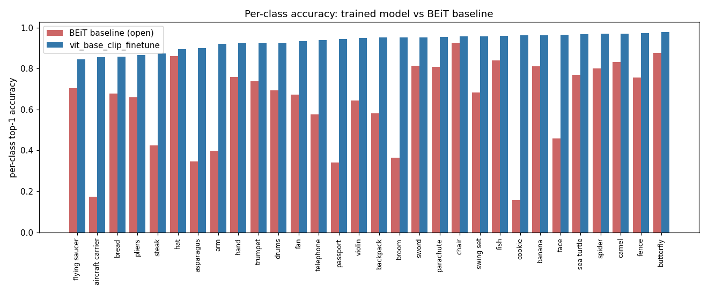
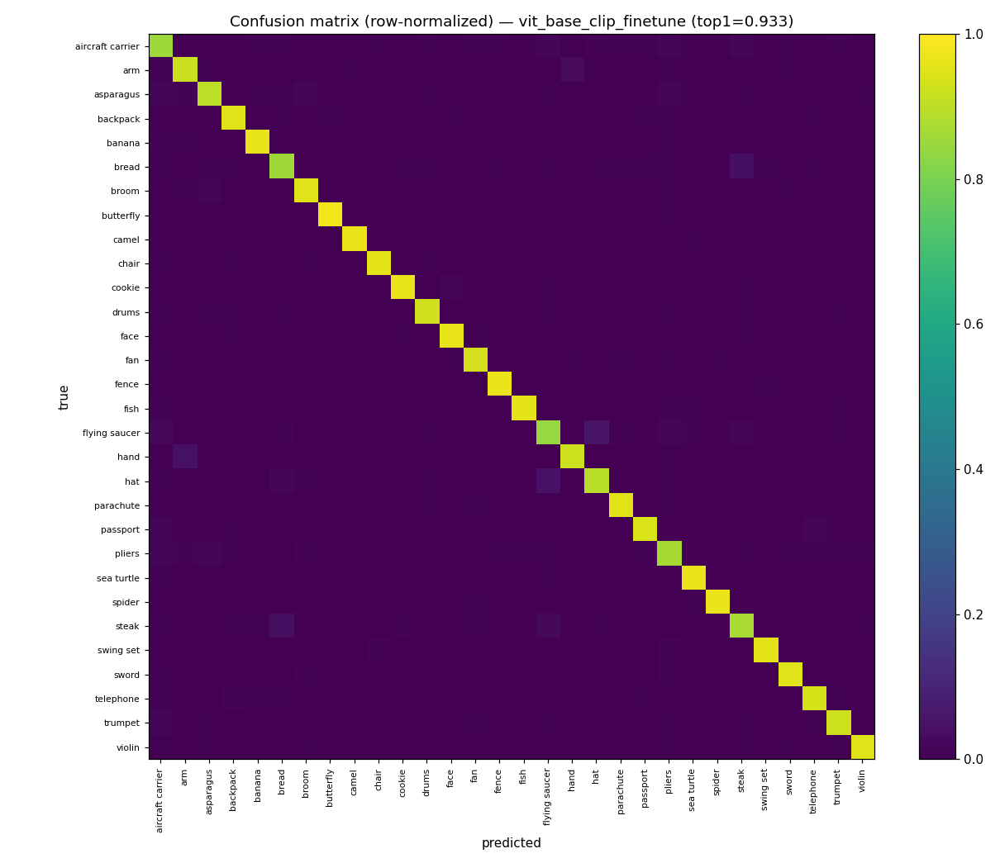
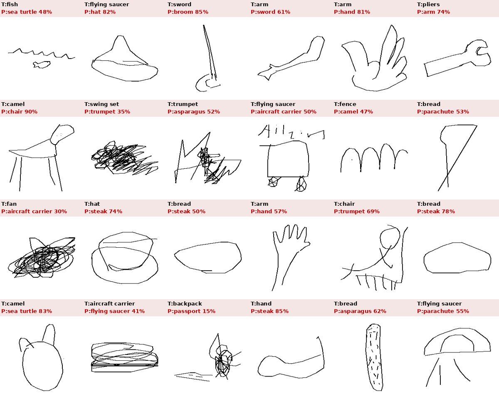
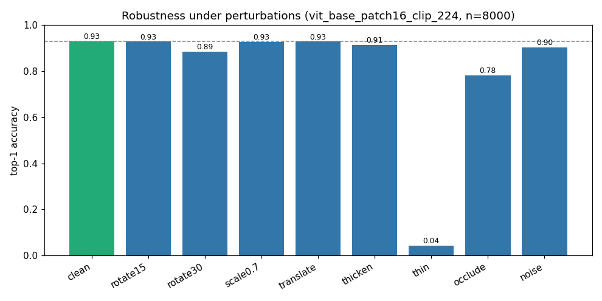

# Sketch Classifier: MLflow training, baseline comparison & analysis

Контрольная точка: переобучить классификатор скетчей под MLflow, честно сравнить с
бейслайном пайплайна, обеспечить воспроизводимость и проанализировать ошибки/устойчивость.

Всё лежит в `sketch_clf/`. Запуски логируются в **MLflow** (SQLite-бэкенд в репозитории:
`sketch_clf/mlflow.db`, артефакты в `sketch_clf/mlartifacts/`).

про mlflow если кратко: поднял локально на sqlite, всё внутри репы, ничего внешнего не надо.
в каждом ране лежат гиперпараметры, метрики по эпохам (val top1/3/5, f1), финальный тест и сам чекпойнт.
посмотреть глазами: `mlflow ui --backend-store-uri sqlite:///$(pwd)/mlflow.db` из папки sketch_clf.

метрики: top-1 главная, top-3/top-5 для пайплайна, macro-f1 как страховка от дисбаланса (тут совпадает с top-1 т.к. классы сбалансированы), эпоху выбираю по val, тест меряю один раз.

результат: лучшая модель (vit-base clip) дала top-1 0.933, top-3 0.968, macro-f1 0.933 на 30к тесте, против beit 0.639 (open-set) и 0.889 (если ограничить теми же 30 классами).

---

## 1. TL;DR

| Модель | Init | Режим | test top-1 | top-3 | macro-F1 | train, s | VRAM |
|---|---|---|---|---|---|---|---|
| **vit_base_clip_finetune** | CLIP (OpenAI) | full finetune | **0.9333** | 0.9675 | 0.9333 | 2166 | 12.4 GB |
| vit_base_finetune | ImageNet-21k | full finetune | 0.9306 | 0.9672 | 0.9307 | 2160 | 12.3 GB |
| vit_small_finetune | ImageNet-21k | full finetune | 0.9260 | 0.9670 | 0.9262 | 960 | 9.3 GB |
| vit_small_linearprobe | ImageNet-21k | frozen + лин. голова | 0.8706 | 0.9492 | 0.8705 | 357 | 1.0 GB |
| **baseline BEiT** (пайплайн) | — | eval-only | **0.6385** (open) / **0.8895** (restr.) | 0.8287 | 0.8907 | — | — |

**Вывод (честная формулировка):** дотюненный ViT/CLIP превосходит бейслайн, но размер
выигрыша зависит от того, как считать:
- **Apples-to-apples (главное число): +4.4 п.п.** — наша модель 93.3% против BEiT,
  ограниченного теми же 30 классами (88.9%). Это «специалист обходит универсала на его
  поле».
- +29.5 п.п. (93.3% vs 63.8% open-set) — **не честное сравнение**: BEiT в этом режиме
  решает 345-классовую задачу, а наша модель — 30-классовую. Привожу как «реальное
  поведение в пайплайне», но не как меру превосходства модели.

Высокое абсолютное число (93%) — не от утечки (см. §2.1), а оттого, что 30 «трудных»
классов были трудны для BEiT в основном из-за *остальных 315* классов (cookie→potato,
face→smiley, broom→rake). В 30-классовой постановке этих отвлекающих классов нет, задача
объективно легче (на всех 345 классах QuickDraw SOTA ~76–78%).

---

## 2. Постановка и честность сравнения

**Бейслайн** — это классификатор, который реально стоит в пайплайне:
`kmewhort/beit-sketch-classifier` (BEiT, 345 классов QuickDraw). В `EDA_30C.md` он даёт
**64.8% top-1** на специально отобранном наборе из 30 «трудных» (визуально похожих)
классов. Я взял **ровно эти 30 классов**, чтобы сравнение было прямым.

**Данные.** QuickDraw simplified NDJSON, 30 классов, **сбалансированно**: по 4500
рисунков на класс → `train=3000 / val=500 / test=1000` (90k / 15k / 30k). Сплиты
**непересекающиеся** и детерминированные (перемешивание с фиксированным seed внутри
класса до разбиения — убирает смещение порядка «recognized first»). Рендеринг —
**точная копия** `quick_draw/v8_tailored.drawing_to_img` (тот самый рендер, что дал
число 64.8%), поэтому train/val/test и оценка BEiT идут на идентичных картинках.

**Две честные точки отсчёта для бейслайна:**
- `test_top1_open = 0.6385` — argmax по всем 345 классам BEiT. Это **реальное поведение
  в пайплайне** (и оно воспроизводит документированные 64.8% — мелкая разница от
  большего теста и шумных лейблов QuickDraw).
- `test_top1_restricted = 0.8895` — argmax только по нашим 30 классам. Это **верхняя
  оценка и фора** бейслайну: мы вручную выкидываем 315 «отвлекающих» классов, на которые
  он чаще всего и срывается. Наша 30-классовая модель такой возможности ошибиться не
  имеет в принципе, поэтому честный «потолок для специалиста на 30 классов» — это 0.8895.

Наша лучшая модель (0.9333) **бьёт даже restricted-бейслайн** (+4.4 п.п.). Оговорка: сам
BEiT обучался на QuickDraw, поэтому его 88.9% могут быть слегка завышены (он мог видеть
похожие рисунки на обучении) — это работает в пользу бейслайна, т.е. +4.4 п.п. —
консервативная оценка с этой стороны; но и у нашей модели есть «домашнее преимущество»
(обучена ровно на этом распределении/рендере/наборе классов).

### 2.1. Проверка на утечку данных (`leakage_check.json`)

Скептический вопрос «а не завышено ли качество утечкой?» проверен явно:

| проверка | результат | вывод |
|---|---|---|
| один ли тестовый файл у BEiT и наших моделей | да, оба `load_split("test")`, 30 000 одинаковых картинок | сравнение честное |
| exact-дубликаты test, попавшие в train | **1 / 30 000** (0.003%) | утечки нет |
| дубликаты val→train / test→val | 1 / 15 000 ; 0 / 30 000 | пренебрежимо |
| уникальность теста | 30 000 / 30 000 | дублей в тесте нет |
| по чему выбрана лучшая эпоха | по `val_top1`; тест считается 1 раз на лучшем чекпойнте | тест не участвует в отборе |
| **gap = test − val (лучшая модель)** | **−0.0014** (тест чуть НИЖЕ val) | будь утечка, тест был бы ВЫШЕ val → её нет |

Нулевой (и даже слегка отрицательный) gap test−val — самое сильное эмпирическое
доказательство: модель не «подсмотрела» тест.

---

## 3. Что обучалось (бюджет ~2–3 ч на RTX 3090, 24 ГБ)

4 модели, все через единый `scripts/train.py`, все залогированы в MLflow:

1. **ViT-small/16 (ImageNet-21k) full finetune** — быстрый основной прогон (16 мин).
2. **ViT-small/16 linear probe** — заморожен бэкбон, учится только голова. Показывает
   «зазор переноса»: чистых ImageNet-фичей хватает на 87%, но домен скетчей требует
   дообучения бэкбона (+5.5 п.п.).
3. **ViT-base/16 (ImageNet-21k) full finetune** — сильнее (36 мин).
4. **ViT-base/16 CLIP (OpenAI) full finetune** — другая предобучка, **лучший результат**.

Общие приёмы: AdamW, раздельные LR для головы (1e-3) и бэкбона (2–3e-5), cosine schedule
с warmup, label smoothing 0.1, mixed precision (fp16). Аугментации — мягкая геометрия
(`RandomAffine`: поворот ±12°, сдвиг 8%, масштаб 0.85–1.1), **без горизонтального
отражения** (классы вроде `arm`, `face`, `telephone` чувствительны к ориентации).

**Баланс классов:** датасет сбалансирован by-construction (равное число на класс во всех
сплитах), поэтому top-1 ≈ macro-F1 во всех прогонах — отдельное взвешивание не требуется,
и macro-F1 логируется как страховка от перекоса.

**Дисциплина бюджета:** перед длинными прогонами — smoke-тест (`--smoke`, 1 эпоха на
урезанных данных) для отлова багов; контроль VRAM (пик 12.4 ГБ из 24 — двукратный запас),
диска (данные 6.7 ГБ, веса ~340 МБ×3) и времени (суммарно ~1.5 ч обучения).

---

## 4. Результаты и сравнение с бейслайном



Синий (наша лучшая модель) — равномерно высокий, 0.84–0.98 по всем классам. Красный
(BEiT, open-set) — проваливается там, где путает с классами вне наших 30:

| класс | BEiT open | наш ViT-CLIP | куда срывался BEiT |
|---|---|---|---|
| cookie | 0.16 | 0.96 | → potato (вне 30 классов) |
| aircraft carrier | 0.17 | 0.86 | → diving board / cruise ship |
| passport | 0.34 | 0.95 | → power outlet |
| asparagus | 0.35 | 0.93 | → … |
| face | 0.46 | 0.96 | → smiley face |

Именно поэтому open-set бейслайн настолько ниже: бóльшая часть его ошибок — это уход в
один из 315 «соседних» классов, которых у обученной 30-классовой модели нет.

---

## 5. Анализ ошибок




Топ-путаницы лучшей модели (на 30k тесте):

```
flying saucer  <-> hat            (51 / 49)
hand           <-> arm            (45 / 27)
bread          <-> steak          (41 / 37)
flying saucer  <-> aircraft carrier (23 / 19)
trumpet         -> aircraft carrier (17)
```

Самые слабые классы: `flying saucer` 0.84, `aircraft carrier` 0.86, `bread` 0.86,
`pliers` 0.87, `steak` 0.87.

**Ключевое отличие от бейслайна по *характеру* ошибок.** В `EDA_30C.md` ошибки BEiT
делятся на 3 типа, и опаснее всего «тип 3 — полный бред» (`passport → power outlet`,
`spider → sun`), который ломает пайплайн необратимо. У нашей модели **тип 3 практически
исчез**: остаются только «тип 1 — реально похожие формы» (летающая тарелка ≈ шляпа —
эллипс с куполом; хлеб ≈ стейк — скруглённый контур с заливкой; рука ≈ кисть). Это
ошибки, в которых ошибся бы и человек, и — что важно для пайплайна — соседние по форме
классы дают похожий ControlNet-результат, т.е. они куда менее «токсичны».

---

## 6. Устойчивость (robustness)

`scripts/robustness.py` гоняет лучшую модель на 8000 тестовых скетчах под
контролируемыми искажениями:



| искажение | top-1 | Δ к clean |
|---|---|---|
| clean | 0.928 | — |
| rotate +15° | 0.928 | ~0 |
| scale ×0.7 | 0.926 | −0.002 |
| translate (+25,+25) | 0.928 | ~0 |
| salt-noise 2% | 0.902 | −0.026 |
| thicken (dilate) | 0.912 | −0.016 |
| rotate +30° | 0.885 | −0.043 |
| occlude (центр 80px) | 0.782 | −0.146 |
| **thin (erode)** | **0.043** | **−0.885** |

**Выводы:**
- Модель **устойчива** к умеренным поворотам, масштабу, сдвигу, шуму и утолщению линий —
  здесь помогли аугментации.
- Заметная просадка под **окклюзией** (вырезанный центр) — −15 п.п.: модель опирается на
  центральную часть формы.
- **Резкий провал при утоньшении штрихов (эрозия)** — это честно вскрытая хрупкость:
  рендер использует тонкие 2px-линии, эрозия 3×3 почти стирает рисунок → на входе
  near-blank, и предсказание разваливается. Практический вывод: классификатор полагается
  на наличие/толщину штриха, и сверхтонкие/полустёртые скетчи пользователя — реальная
  зона риска. Лечится аугментацией по толщине линии (erode/dilate) на обучении.

---

## 7. Воспроизводимость и артефакты

Всё в репозитории, в папке `sketch_clf/`:

```
sketch_clf/
├── REPORT.md                  # этот отчёт
├── leaderboard.json           # сводка по всем прогонам
├── requirements_train.txt     # пины версий (torch 2.6+cu124, transformers, timm, mlflow…)
├── mlflow.db                  # MLflow tracking (SQLite) — params/metrics/runs
├── mlartifacts/<run_id>/…     # MLflow-артефакты: чекпойнты, отчёты, confusion
├── artifacts/<run_name>/      # дубликат артефактов на диске (best.pt, *_report.json,
│                              #   per_class_acc.json, confusion_matrix.npy, top_confusions.json)
├── report_images/             # графики для отчёта (leaderboard.md, confusion, per-class, errors)
├── data/                      # рендеренный датасет .npy + meta.json (регенерируется скриптом)
└── scripts/
    ├── prepare_data.py        # скачать+отрендерить QuickDraw → сбалансированные сплиты
    ├── common.py              # пути, MLflow setup, Dataset
    ├── train.py               # обучение + логирование + тест + артефакты
    ├── baseline_eval.py       # оценка BEiT на нашем тесте (open + restricted)
    ├── robustness.py          # устойчивость к искажениям
    ├── analyze.py             # лидерборд + графики из MLflow
    ├── error_grid.py          # монтаж ошибок
    └── run_all.sh             # последовательный прогон 4 моделей
```

**Полный повтор с нуля:**
```bash
PY=/venv/main/bin/python
cd sketch_clf/scripts
$PY prepare_data.py            # данные (детерминированно, seed=42)
$PY baseline_eval.py           # бейслайн BEiT → MLflow
bash run_all.sh                # 4 модели → MLflow + artifacts/
$PY analyze.py                 # лидерборд + графики
$PY robustness.py --ckpt ../artifacts/vit_base_clip_finetune/best.pt
$PY error_grid.py --ckpt ../artifacts/vit_base_clip_finetune/best.pt
```
Просмотр: `mlflow ui --backend-store-uri sqlite:///$(pwd)/../mlflow.db`

Каждый прогон логирует: гиперпараметры, число параметров (всего/обучаемых), per-epoch
`train_loss`/`val_top1/3/5`/`macro_f1`, финальные `test_*`, время обучения, пик VRAM, и
артефакты (чекпойнт + classification report + confusion matrix + top confusions +
per-class accuracy). Детерминизм: фиксированные seed в подготовке данных и порядке
сплитов; pretrained-инициализация; те же 30 классов и тот же рендер, что у бейслайна.

---

## 8. Итог по пунктам контрольной точки

- ⭐ **MLflow поднят и логирует** — SQLite-бэкенд + артефакты внутри репозитория, 5
  основных прогонов (4 обученных + бейслайн) с полным набором метрик и артефактов.
- ⭐ **Лучшая модель переобучена и залогирована** — ViT-base/CLIP, **93.3% top-1**,
  чекпойнт сохранён как артефакт.
- ⭐ **Воспроизводимость и артефакты** — пины версий, детерминированные сплиты, скрипты
  end-to-end, веса/отчёты/графики в репозитории.
- ⭐ **Анализ ошибок и устойчивости** — confusion-анализ (ошибки свелись к реально
  похожим формам, «тип-3 бред» исчез), per-class сравнение с бейслайном, робастность к 8
  искажениям с вскрытой хрупкостью на утоньшении штрихов.
- **Сравнение с бейслайном (честно):** apples-to-apples выигрыш — **+4.4 п.п.** к BEiT,
  ограниченному теми же 30 классами (93.3% vs 88.9%). Число +29.5 п.п. (vs open-set
  63.8%) — это разные задачи (345 vs 30 классов), приведено только как «реальное
  поведение пайплайна», не как мера превосходства. Утечка данных исключена проверкой
  (§2.1): дублей test↔train 1/30000, gap test−val ≈ 0.
